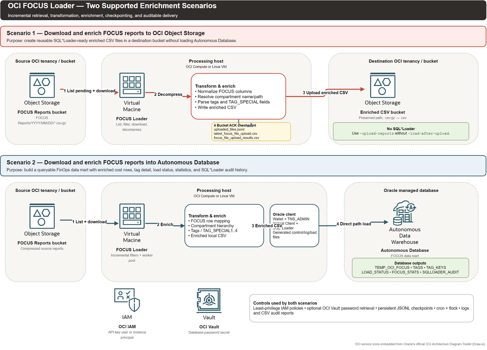

# OCI FOCUS Loader and Transformed-CSV Uploader

Version `26.5.10-wallet-acl-guidance`

> **Independent project disclaimer**
>
> This is a personal, experimental utility. It is not affiliated with, endorsed, certified, or supported by Oracle Corporation. Oracle, OCI, Exadata, and Autonomous Database are trademarks of Oracle and/or its affiliates. Review the source, validate results against OCI's official cost-management data, apply least-privilege permissions, back up checkpoints, and test in a controlled environment before production use.

This Go application retrieves OCI FOCUS cost reports from Object Storage, transforms the gzip CSV files locally, and can:

- load the transformed data into Oracle Database with SQL*Loader;
- upload the transformed CSV files to another OCI Object Storage bucket without SQL*Loader;
- upload each transformed CSV and then load it;
- generate pre-load detail, summary, and capacity-planning reports;
- display the first `$TNS_ADMIN/tnsnames.ora` alias in a lightweight, read-only browser interface;
- provide an optional modular Streamlit interface for alias selection, diagnostics, and validated command generation;
- run incrementally from cron with durable load and upload checkpoints.

An [Ansible project](ansible/README.md) is included to build the Linux binary,
deploy the target schema, synchronize `focus.conf`, and run the loader using
variable-driven settings and protected secrets.

The source prefix is `FOCUS Reports/`. Destination object names preserve the source path and remove only the final `.gz` suffix.

> Important: loader, upload-only, and pre-load modes connect to Oracle Database. The read-only `-tns-gui` mode is the exception: it reads only `$TNS_ADMIN/tnsnames.ora` and requires neither database nor OCI credentials.

## Goal of this utility

The utility's goal is to turn raw OCI FOCUS cost-report objects into reliable, enriched, incrementally processed FinOps data. It automates the operational work between the OCI-generated `.csv.gz` reports and one of two durable consumption targets:

1. an OCI Object Storage bucket containing reusable enriched CSV files; or
2. an Oracle Autonomous Database containing queryable FOCUS rows and operational audit tables.

It is designed for recurring production retrieval, not only one-time conversion. It discovers source objects, excludes objects already completed for the selected target, downloads and validates each gzip CSV, enriches every row, delivers the result, and records enough state to restart safely after interruption.

The utility enriches the source data by:

- adding the OCI source tenancy name and a source file identifier to every row;
- preserving and mapping the FOCUS billing, pricing, charge, usage, SKU, commitment, and OCI extension fields expected by `focus.ctl`;
- resolving `oci_CompartmentId` to the complete OCI compartment hierarchy path;
- parsing the `Tags` JSON when tag processing is enabled;
- extracting configured tag keys into `TAG_SPECIAL1` through `TAG_SPECIAL4`;
- optionally creating row-level tag data and unique tag-key/value metadata for Autonomous Database;
- normalizing date/time slices and writing a deterministic SQL*Loader-ready CSV;
- recording row counts, sizes, timings, OCI upload identifiers, SQL*Loader results, and restart checkpoints.

This utility is useful when FinOps, cloud governance, platform, or data-engineering teams need a repeatable pipeline without introducing a separate ETL platform.

## Primary use cases

### Use case 1: download and enrich FOCUS reports to Object Storage

Choose this scenario when the enriched CSV is the product and SQL*Loader must not run. Typical uses include creating a curated FOCUS data lake, sharing standardized cost files with another tenancy or analytics platform, archiving enriched reports, or decoupling collection from a later database load.

For each source object, the utility:

1. lists `FOCUS Reports/` objects and applies exact-name, date, and upload-checkpoint filters;
2. downloads the selected `.csv.gz` object to the Linux work directory;
3. decompresses and enriches the FOCUS rows locally;
4. uploads the resulting `.csv` to the destination namespace, bucket, region, and optional prefix;
5. waits for a successful OCI `PutObject` response;
6. updates `uploaded_files.jsonl`, the latest-upload CSV, and the per-run upload-results CSV;
7. removes temporary gzip/CSV files unless `-keep-work-files` is set;
8. stops without generating a control file, running SQL*Loader, or writing database load/audit rows.

Enable it with `-upload-reports` and do **not** specify `-load-after-upload`. Upload-only history is independent of database load history. Use a distinct `-upload-state-file` for each destination bucket/prefix combination.

### Use case 2: download and enrich FOCUS reports into Autonomous Database

Choose this scenario when the target is a queryable FinOps data mart in Autonomous Data Warehouse or Autonomous Transaction Processing. Typical uses include SQL analysis, cost allocation, chargeback/showback, anomaly investigation, dashboarding, tag-governance reporting, and historical audit.

For each source object, the utility:

1. excludes objects already present in the configured `LOAD_STATUS` table or local `processed_files.jsonl` state;
2. downloads and enriches the source file with tenancy, file, compartment, and tag information;
3. writes an enriched local CSV matching `focus.ctl`;
4. optionally inserts row-level tags into `TEMP_OCI_FOCUS_TAGS` in batches;
5. generates an object-specific SQL*Loader control file;
6. invokes `sqlldr` with the configured Autonomous Database user, wallet/connect alias, and error/log files;
7. parses the SQL*Loader result and records inserted, failed, rejected, discarded, skipped, and total-read rows in `SQLLOADER_AUDIT`;
8. writes load status/statistics and unique tag-key/value metadata after a successful load;
9. appends the source object to `processed_files.jsonl` so cron restarts remain incremental;
10. removes temporary files unless `-keep-work-files` is set.

The database scenario can optionally upload the enriched CSV first by combining `-upload-reports` with `-load-after-upload`. In that combined mode, SQL*Loader begins only after the corresponding destination upload succeeds.

## Architecture diagram



[Open the editable Draw.io source](docs/architecture/focus-loader-scenarios.drawio).

The editable diagram embeds Object Storage, Compute VM, IAM, Vault, and Autonomous Data Warehouse stencils from Oracle's official [OCI Architecture Diagram Toolkit](https://docs.oracle.com/en-us/iaas/Content/General/Reference/graphicsfordiagrams.htm).

## Modular Streamlit frontend

The optional [Streamlit frontend](streamlit-ui/README.md) runs as an independent
Python service. It calls versioned, read-only endpoints in the Go process and
does not access the wallet or `tnsnames.ora` itself. This keeps form, navigation,
chart, and future dashboard work outside the loader binary.

Current interactions include:

- backend health and version checks;
- display and selection of every alias in `$TNS_ADMIN/tnsnames.ora`;
- diagnostic API output without connect descriptors or wallet content;
- a validated command builder covering all four loader processing modes;
- POSIX-safe command preview and reviewed shell-script download.

The interface deliberately does not execute the generated command and never
asks for a database password. Use the Vault secret OCID field and review the
downloaded command before manual execution. Both the Go API and Streamlit
services bind to loopback by default and are reached through SSH/OCI Bastion or
an authenticated TLS reverse proxy.

Quick deployment after installing the `26.5.4-streamlit` Go binary:

```bash
sudo dnf install -y python3.11 python3.11-pip
sudo TNS_ADMIN=/opt/oracle/wallet PYTHON_BIN=python3.11 \
  ./scripts/install-streamlit-ui.sh
./scripts/test-streamlit-ui.sh
```

From a Windows workstation, use the included OCI Bastion launcher with the
existing Bastion and Compute OCIDs:

```powershell
.\linux8-streamlit-bastion\connect-streamlit-bastion.ps1 `
  -BastionId 'ocid1.bastion.oc1.eu-frankfurt-1.REPLACE' `
  -InstanceId 'ocid1.instance.oc1.eu-frankfurt-1.REPLACE' `
  -PrivateIp '10.30.1.10' `
  -Region 'eu-frankfurt-1' `
  -SshPrivateKeyPath "$HOME\.ssh\bastion_ed25519"
```

Keep PowerShell open and browse to `http://127.0.0.1:8501/`. The launcher
creates a temporary managed-SSH session on the existing Bastion and deletes it
when the tunnel closes. Complete installation, laptop prerequisites, manual
deployment, systemd, API, upgrade, rollback, and troubleshooting steps are in
[`linux8-streamlit-bastion/README.md`](linux8-streamlit-bastion/README.md) and
[`streamlit-ui/README.md`](streamlit-ui/README.md).

Both installation guides include a least-privilege ACL procedure for the case
where `TNS_ADMIN=/home/oracle/adb_wallet` remains owned by `oracle` while the
read-only alias service runs as `focusloader`.

Two complete Windows authentication wrappers are also available:

- [`windows-browser-auth-streamlit/README.md`](windows-browser-auth-streamlit/README.md)
  creates and validates a temporary OCI CLI security-token profile through
  browser sign-in.
- [`windows-api-key-auth-streamlit/README.md`](windows-api-key-auth-streamlit/README.md)
  safely creates or validates a named local OCI API-key profile from explicit
  parameters, preserving other profiles and backing up changed configuration.

## Contents

- [Goal of this utility](#goal-of-this-utility)
- [Primary use cases](#primary-use-cases)
- [Architecture diagram](#architecture-diagram)
- [Modular Streamlit frontend](#modular-streamlit-frontend)
- [Processing modes](#processing-modes)
- [How incremental processing works](#how-incremental-processing-works)
- [Requirements](#requirements)
- [Linux installation](#linux-installation)
- [Oracle client and wallet setup](#oracle-client-and-wallet-setup)
- [OCI authentication and IAM](#oci-authentication-and-iam)
- [Database setup](#database-setup)
- [Build and test](#build-and-test)
- [Read-only TNS alias GUI](README_TNS_GUI.md)
- [Complete Streamlit deployment guide](streamlit-ui/README.md)
- [Windows browser-authentication tunnel](windows-browser-auth-streamlit/README.md)
- [Windows API-key-authentication tunnel](windows-api-key-auth-streamlit/README.md)
- [Complete command-line flag reference](#complete-command-line-flag-reference)
- [Usage examples](#usage-examples)
- [Cron-based incremental retrieval](#cron-based-incremental-retrieval)
- [Operations and recovery](#operations-and-recovery)
- [Troubleshooting](#troubleshooting)
- [Security checklist](#security-checklist)

## Processing modes

| Mode | Required flags | Result |
| --- | --- | --- |
| Database load | no mode flag | Downloads, transforms, runs SQL*Loader, writes audit/load status, and checkpoints the loaded source object. |
| Upload only | `-upload-reports -report-upload-bucket BUCKET` | Downloads, transforms, uploads CSV, skips SQL*Loader/database writes, and checkpoints the uploaded source object. |
| Upload and load | upload flags plus `-load-after-upload` | Uploads each transformed CSV and runs SQL*Loader only after that upload succeeds. |
| Pre-load report | `-preload-report` | Creates reports and stops unless `-continue-after-report` is supplied. |
| Metadata-only report | `-skip-preload-content-scan` | Avoids report-time object download/decompression/row counting. |
| TNS alias GUI | `-tns-gui` | Starts a read-only browser page showing the first alias from `$TNS_ADMIN/tnsnames.ora`; skips database and OCI initialization. |

Pipeline:

```text
OCI source object (.csv.gz)
  -> local download
  -> gzip decompression and FOCUS transformation
  -> local SQL*Loader-ready .csv
  -> optional destination Object Storage upload
  -> optional SQL*Loader execution
  -> durable checkpoint
```

## How incremental processing works

Database-load runs skip objects already present in either:

- the configured Oracle `LOAD_STATUS` table; or
- `work_report_dir/processed_files.jsonl`, configurable with `-state-file`.

Upload-only runs use an independent destination checkpoint and skip objects present in:

- `work_report_dir/uploaded_files.jsonl`, configurable with `-upload-state-file`.

Database load history does not suppress upload-only work. This allows a new destination bucket to receive source files that were already loaded into Oracle. Use a different upload-state file for each independent destination bucket/prefix.

The upload checkpoint is appended only after the transformed CSV is accepted by the destination bucket and the local latest-upload CSV is written. Keep checkpoint files on persistent storage and back them up. Do not put them in `/tmp`.

`-force` intentionally ignores database and local checkpoints. Combine it with `-f 'FOCUS Reports/.../file.csv.gz'` to replay one object. Avoid unattended `-force` in cron.

`-d YYYY-MM-DD` is an inclusive lower bound derived from the object path. For scheduled retrieval, use a stable historical lower bound so late-arriving objects are still discovered; checkpoints prevent duplicates.

## Requirements

- Linux x86-64 or Arm64.
- Go 1.21 or newer to build.
- `gcc` and CGO to compile the `godror` Oracle driver.
- Oracle Instant Client Basic for all modes.
- Oracle Instant Client Tools for SQL*Loader modes (`sqlldr`).
- SQL*Plus if using the included schema deployment helper.
- An Autonomous Database wallet or other working Oracle Net configuration.
- OCI API-key configuration or OCI instance principals.
- Source Object Storage read access and, for upload modes, destination write access.
- Oracle tables matching `focus.conf`.
- `flock` and cron for the supplied scheduled-run wrapper.
- Optional Streamlit frontend: Oracle Linux 8.8 or newer, Python 3.11, `python3.11-pip`, and `curl`.

## Linux installation

### 1. Create a service account and directories

```bash
sudo useradd --system --create-home --shell /bin/bash focusloader
sudo install -d -o focusloader -g focusloader -m 0750 /opt/focus-loader
sudo install -d -o focusloader -g focusloader -m 0750 /var/lib/focus-loader
sudo install -d -o focusloader -g focusloader -m 0750 /var/log/focus-loader
sudo install -d -o root -g focusloader -m 0750 /etc/focus-loader
```

### 2. Install build and scheduling tools

Oracle Linux 8/9:

```bash
sudo dnf install -y git gcc make libaio unzip tar cronie util-linux
sudo systemctl enable --now crond
```

Ubuntu/Debian:

```bash
sudo apt-get update
sudo apt-get install -y git build-essential libaio1 unzip cron util-linux
sudo systemctl enable --now cron
```

On distributions where `libaio1` was renamed, install the available `libaio` runtime package such as `libaio1t64`.

Install Go 1.21+ from your distribution or the official [Go downloads](https://go.dev/dl/), then verify:

```bash
go version
gcc --version
```

### 3. Clone the repository

```bash
sudo -u focusloader git clone https://github.com/eugsim1/focus-loader-report-upload.git /opt/focus-loader/src
cd /opt/focus-loader/src
```

Replace the placeholder repository URL after publishing.

## Oracle client and wallet setup

### Oracle Linux RPM installation

Oracle documents `dnf` installation for Oracle Linux 8/9. Install the release repository and matching Basic, SQL*Plus, and Tools packages:

```bash
sudo dnf install -y oracle-release-el9
sudo dnf install -y oracle-instantclient-basic oracle-instantclient-sqlplus oracle-instantclient-tools
```

Use `oracle-release-el8` on Oracle Linux 8. Package names/versions can vary by enabled repository; list candidates with:

```bash
dnf list available 'oracle-instantclient*'
```

The Tools package provides SQL*Loader. Basic and Tools must be compatible versions. See Oracle's [Instant Client RPM instructions](https://docs.oracle.com/en/database/oracle/oracle-database/26/lacli/install-instant-client-using-rpm.html) and [SQL*Loader Instant Client guide](https://docs.oracle.com/en/database/oracle/oracle-database/21/sutil/instant-client-sql-loader-export-import.html).

### ZIP installation on other Linux distributions

Download matching Basic and Tools ZIP packages, plus SQL*Plus if needed, from [Oracle Instant Client downloads](https://www.oracle.com/database/technologies/instant-client/downloads.html). Unzip them into the same directory:

```bash
sudo mkdir -p /opt/oracle
sudo unzip instantclient-basic-linux.*.zip -d /opt/oracle
sudo unzip instantclient-tools-linux.*.zip -d /opt/oracle
sudo unzip instantclient-sqlplus-linux.*.zip -d /opt/oracle
sudo sh -c 'echo /opt/oracle/instantclient_23_x > /etc/ld.so.conf.d/oracle-instantclient.conf'
sudo ldconfig
```

Replace `instantclient_23_x` with the extracted directory.

### Verify the client

```bash
find /usr/lib/oracle /opt/oracle -name libclntsh.so -o -name sqlldr -o -name sqlplus 2>/dev/null
ldconfig -p | grep libclntsh
sqlldr -version
sqlplus -version
```

### Wallet

```bash
sudo install -d -o focusloader -g focusloader -m 0700 /opt/oracle/wallet
sudo unzip WalletDatabase.zip -d /opt/oracle/wallet
sudo chown -R focusloader:focusloader /opt/oracle/wallet
sudo chmod -R go-rwx /opt/oracle/wallet
export TNS_ADMIN=/opt/oracle/wallet
tnsping focusdb_high
```

Confirm the database connection from the same account and environment used by cron:

```bash
sudo -u focusloader env TNS_ADMIN=/opt/oracle/wallet \
  sqlplus 'FOCUS_APP@focusdb_high'
```

## OCI authentication and IAM

### Option A: instance principals (recommended on OCI Compute)

Create a dynamic group matching the compute instance, then grant only the required permissions. Example policy shapes:

```text
Allow dynamic-group focus-loader-dg to read objects in compartment SOURCE_COMPARTMENT where target.bucket.name='SOURCE_BUCKET'
Allow dynamic-group focus-loader-dg to inspect buckets in compartment SOURCE_COMPARTMENT
Allow dynamic-group focus-loader-dg to manage objects in compartment DESTINATION_COMPARTMENT where target.bucket.name='DESTINATION_BUCKET'
Allow dynamic-group focus-loader-dg to inspect buckets in compartment DESTINATION_COMPARTMENT
Allow dynamic-group focus-loader-dg to read secret-bundles in compartment SECURITY_COMPARTMENT
Allow dynamic-group focus-loader-dg to inspect compartments in tenancy
```

Policy syntax and tenancy layout vary; validate with your OCI administrator. Run the application with `-ip`. If `-ds` is used with instance principals, leave `-dst` unset.

### Option B: OCI config/API key

Create `~/.oci/config` and protect it and its key:

```ini
[DEFAULT]
user=ocid1.user.oc1..example
fingerprint=aa:bb:cc:dd
tenancy=ocid1.tenancy.oc1..example
region=eu-frankfurt-1
key_file=/home/focusloader/.oci/oci_api_key.pem
```

```bash
chmod 700 /home/focusloader/.oci
chmod 600 /home/focusloader/.oci/config /home/focusloader/.oci/oci_api_key.pem
```

Use `-c /home/focusloader/.oci/config -t DEFAULT`. For Vault retrieval with config-file authentication, also set `-dst DEFAULT` (or the appropriate secret profile).

### Validate access to the Oracle-managed FOCUS report bucket

Before running the loader with API-key authentication, use
`scripts/test_focus_bucket_access.sh` to verify that the configured OCI user can
list the FinOps FOCUS reports. The standard source location is:

- namespace `bling`;
- bucket name equal to the customer tenancy OCID;
- object prefix `FOCUS Reports/`;
- the tenancy home region.

Set the same configuration, profile, tenancy, and region that the loader will
use:

```bash
export OCI_CLI_CONFIG_FILE=/home/focusloader/.oci/config
export OCI_CONFIG_PROFILE=DEFAULT
export OCI_TENANCY='ocid1.tenancy.oc1..example'
export REGION=eu-frankfurt-1

chmod 700 scripts/test_focus_bucket_access.sh
./scripts/test_focus_bucket_access.sh
```

The script first displays up to five matching objects and then follows all
pagination pages to count every object under `FOCUS Reports/`. A successful
result proves that the selected API-key identity can list the report objects.
An object count of zero means access succeeded but no objects matched the
prefix.

Optional source overrides:

```bash
FOCUS_NAMESPACE=bling \
FOCUS_BUCKET="$OCI_TENANCY" \
FOCUS_PREFIX='FOCUS Reports/' \
./scripts/test_focus_bucket_access.sh
```

OCI Cost and Usage reports require a special cross-tenancy endorsement. Open
**Billing & Cost Management > Cost and Usage Reports** in the tenancy home
region and copy the reporting-tenancy `Define` statement displayed by OCI
exactly. Reporting-tenancy OCIDs can differ, so the Console-provided statement
is authoritative. Replace only the identity domain/group name in the second
statement:

```text
Define tenancy usage-report as <reporting-tenancy-ocid-shown-by-OCI-console>
Endorse group <identity-domain>/<group-name> to read objects in tenancy usage-report
```

For a group in the default identity domain, the second statement can be:

```text
Endorse group <group-name> to read objects in tenancy usage-report
```

Confirm that the API-key user belongs to the endorsed group. Policy changes can
take several minutes to propagate. This helper invokes the OCI CLI with a
configuration file and does not test instance-principal authentication.

## Database setup

Edit `focus.conf` so `[database] schema` and `[tables]` match the target database. Table values can be unqualified because the schema is prepended automatically.

The updated `scripts/deploy_focus_schema_with_columns_csv.sh` creates the
expected schema objects, updates its selected `focus.conf`, copies the updated
configuration to `../focus.conf` by default, and generates a CSV data
dictionary containing one row for every deployed table column. The dictionary
includes datatype, length, precision, scale, nullability, defaults,
identity/virtual-column flags, collation, partitioning, compression, logging,
and tablespace metadata.

The script accepts administrator and target-schema credentials as positional
arguments:

```bash
cd /opt/focus-loader/src/scripts
chmod 700 deploy_focus_schema_with_columns_csv.sh
export TNS_ADMIN=/opt/oracle/wallet
cp -p ../focus.conf ./focus.conf

DROP_EXISTING=false \
COLUMN_CSV=../FOCUS_APP_table_columns.csv \
PARENT_CONFIG_FILE=../focus.conf \
./deploy_focus_schema_with_columns_csv.sh \
  ADMIN '<admin-password>' focusdb_high \
  FOCUS_APP '<schema-password>' focus.conf
```

`DROP_EXISTING` defaults to `true`, which executes `DROP USER ... CASCADE` when
the target user exists. Set it explicitly on every run. With
`DROP_EXISTING=false`, a missing user is created and an existing user is
retained with its password updated; however, the table DDL is not idempotent and
will fail if those tables already exist. Do not rerun the full deployment
against a populated schema merely to regenerate the column CSV.

The generated CSV defaults to `<TARGET_SCHEMA>_table_columns.csv` and can be
changed with `COLUMN_CSV`. The parent configuration destination defaults to
`../focus.conf` and can be changed with `PARENT_CONFIG_FILE`. Verify both after
deployment:

```bash
grep -nE '^\[database\]|^[[:space:]]*schema[[:space:]]*=|^[[:space:]]*LOAD_STATUS' ../focus.conf
head -n 5 ../FOCUS_APP_table_columns.csv
```

The script passes both passwords through process arguments; execute it only on
a controlled host and avoid retaining the command in shared shell history.
Test the target account with SQL*Plus before starting the loader.

## Build and test

Build natively on the target architecture; CGO cross-compilation requires a matching cross-compiler and is not covered by the helper.

```bash
cd /opt/focus-loader/src
go mod download
go mod verify
CGO_ENABLED=1 go test ./...
chmod +x build-linux.sh
./build-linux.sh
```

For native Arm64:

```bash
GOARCH=arm64 OUTPUT=dist/focus-loader-report-upload-linux-arm64 ./build-linux.sh
```

Install the binary and runtime files:

```bash
sudo install -o focusloader -g focusloader -m 0750 \
  dist/focus-loader-report-upload-linux-amd64 /opt/focus-loader/focus-loader-report-upload
sudo install -o focusloader -g focusloader -m 0640 focus.conf /opt/focus-loader/focus.conf
sudo install -o focusloader -g focusloader -m 0640 focus.ctl /opt/focus-loader/focus.ctl
sudo install -o focusloader -g focusloader -m 0750 scripts/run-incremental.sh /opt/focus-loader/run-incremental.sh
sha256sum /opt/focus-loader/focus-loader-report-upload
/opt/focus-loader/focus-loader-report-upload -version
```

The executable dynamically loads Oracle client libraries. A binary that builds successfully can still fail at runtime if `libclntsh.so` is unavailable.

Test the modular frontend support code without starting a server:

```bash
cd streamlit-ui
python3.11 -m unittest discover -s tests -v
python3.11 -m compileall -q app.py focus_api.py command_builder.py tests
```

For an interactive development server, create an isolated virtual environment
and follow [streamlit-ui/README.md](streamlit-ui/README.md).

## Complete command-line flag reference

All relative paths are resolved from the process working directory. The supplied cron wrapper changes to `APP_DIR` before starting the binary, which makes `focus.conf`, `focus.ctl`, and the default `work_report_dir` paths predictable.

### Help, version, selection, and execution controls

| Flag | Type/default | Detailed behavior |
| --- | --- | --- |
| `-h`, `--help` | Boolean | Prints Go flag help and exits. `-h` is provided automatically by the Go flag package. |
| `-version` | Boolean, default `false` | Prints the binary name and application version, then exits before OCI or database initialization. |
| `-f` | String, default empty | Processes only the exact, case-sensitive full source object name, for example `FOCUS Reports/2026/07/01/file.csv.gz`. This is the safest way to test or replay one object. The object must also pass date/checkpoint filters unless `-force` is used. |
| `-d` | `YYYY-MM-DD`, default empty | Inclusive minimum report date. The date is derived from the `FOCUS Reports/YYYY/MM/DD/...` object path and compared lexically. Use zero-padded ISO format. A stable historical value is safer for cron because late-arriving reports remain discoverable. |
| `-force` | Boolean, default `false` | Ignores Oracle `LOAD_STATUS`, database-load state, and upload-only state when building the pending set. It can re-download, overwrite destination objects, and reload duplicate database data. Prefer `-force -f EXACT_OBJECT` for controlled recovery; do not schedule it routinely. |
| `-workers` | Integer, default `1` | Number of files processed concurrently. Must be at least 1 and is capped internally to the number of pending objects. More workers increase OCI requests, local disk usage, memory, Oracle sessions, and SQL*Loader pressure. Start with 1–4 and measure. |
| `-verbose` | Boolean, default `false` | Prints detailed per-file pre-load inspection and transformed-upload progress. Without it, upload progress is printed periodically and at completion. Useful for diagnosis but can create large cron logs. |
| `-keep-work-files` | Boolean, default `false` | Retains downloaded gzip files and generated CSV/control artifacts after successful processing. Normally successful work files are removed. Failure artifacts may remain even without this flag so they can be investigated. Plan disk capacity before enabling it. |
| `-tns-gui` | Boolean, default `false` | Starts the built-in read-only TNS alias web page and exits before database/OCI validation. It reads the first alias from `$TNS_ADMIN/tnsnames.ora`. |
| `-tns-gui-listen` | String, default `127.0.0.1:8080` | Listener used with `-tns-gui`. Keep the loopback default and reach it through SSH; a non-loopback listener has no built-in authentication. |

### OCI authentication, source location, and networking

| Flag | Type/default | Detailed behavior |
| --- | --- | --- |
| `-c` | Path, default empty | OCI CLI/API-key configuration file. If omitted, the SDK default provider is used unless `-ip` is set. Common value: `$HOME/.oci/config`. |
| `-t` | String, default empty/`DEFAULT` | Profile section in the OCI config file used for the main Identity and Object Storage clients. It does not automatically select the Vault-secret profile; see `-dst`. |
| `-ip` | Boolean, default `false` | Uses OCI instance-principal authentication for Identity and Object Storage. Recommended for OCI Compute cron jobs because no API private key is stored on disk. Requires dynamic-group membership and policies. |
| `-ns` | String, default `bling` | Source Object Storage namespace containing the OCI FOCUS reports. Override it for the actual tenancy namespace. This is not the bucket name. |
| `-bn` | String, default empty | Source Object Storage bucket. If empty, the code uses the tenancy OCID as the bucket name. Explicitly set this flag whenever the source bucket uses another name. |
| `-p` | String, default empty | HTTP(S) proxy applied to OCI SDK clients. Example: `http://proxy.example.com:8080`. If the scheme is omitted, the code prepends `https://`. This flag does not configure SQL*Loader or Oracle Net proxying. |

The source client lists objects under the fixed prefix `FOCUS Reports/`. The source Object Storage client is set to the tenancy home region in this version.

### Autonomous Database credentials and SQL*Loader

| Flag | Type/default | Detailed behavior |
| --- | --- | --- |
| `-du` | String, required | Oracle/Autonomous Database user. Required in all current modes, including upload-only and reports, because startup connects to the database and reads load history. |
| `-dn` | String, required | Oracle connect string or TNS alias, such as `focusdb_high`. `TNS_ADMIN` must expose the referenced wallet/network configuration. |
| `-dp` | String, default empty | Plain database password. Either `-dp` or `-ds` is required. This value is masked in application logging but may be visible in the host process list or shell history; avoid it in cron. |
| `-ds` | OCI secret OCID, default empty | Retrieves the database password from an OCI Vault secret bundle. The secret content must decode to the password expected by Oracle. Recommended for scheduled execution. |
| `-dst` | String, default empty | OCI profile used specifically to read `-ds`. If empty or `local`, secret retrieval uses instance principals. For API-key authentication, supply a config profile such as `-dst DEFAULT`. |
| `-ctl` | Path, default `focus.ctl` | SQL*Loader control-file template. The program replaces table/data-file tokens and writes a per-file generated control file. Used only when SQL*Loader runs. Keep it aligned with the transformed CSV column order and target table. |

Startup currently requires `-du`, `-dn`, and either `-dp` or `-ds`, even when `-upload-reports` is used without SQL*Loader.

### Tag enrichment and performance

| Flag | Type/default | Detailed behavior |
| --- | --- | --- |
| `-ts1` | String, default empty | Exact JSON tag key to copy into transformed column `TAG_SPECIAL1`. The `oracleidentitycloudservice/` prefix is removed from the selected value and values are truncated to 4,000 characters. |
| `-ts2` | String, default empty | Same behavior as `-ts1`, targeting `TAG_SPECIAL2`. |
| `-ts3` | String, default empty | Same behavior as `-ts1`, targeting `TAG_SPECIAL3`. |
| `-ts4` | String, default empty | Same behavior as `-ts1`, targeting `TAG_SPECIAL4`. |
| `-ts5` | String, accepted but currently unused | The parser accepts this option, but version 26.5.1 transforms and writes only `TAG_SPECIAL1` through `TAG_SPECIAL4`; no `TAG_SPECIAL5` value is produced. Do not rely on `-ts5` until the schema, control file, and transformer add fifth-column support. |
| `-skip-tags` | Boolean, default `false` | Fastest transformation. Preserves the raw `Tags` field but skips JSON parsing, row-level tag creation, unique tag-key/value metadata, and `TAG_SPECIAL1..4` extraction. It automatically enables `-skip-tag-rows` and `-skip-tag-keys`; special columns remain null. |
| `-skip-tag-rows` | Boolean, default `false` | Parses tags and can populate special columns/unique metadata, but does not insert individual tag rows into `TEMP_OCI_FOCUS_TAGS`. Upload-only mode enables this automatically to prevent database writes. |
| `-skip-tag-keys` | Boolean, default `false` | Skips the post-load insertion of unique tag key/value metadata into the configured `TAG_KEYS` table. It does not by itself disable JSON parsing, special columns, or row-level tag inserts. Upload-only mode enables it automatically. |

Tag-key matching for `-ts1` through `-ts4` is exact and case-sensitive. Runtime diagnostics report match and non-empty-value counts for every configured special tag.

### Database and upload restart checkpoints

| Flag | Type/default | Detailed behavior |
| --- | --- | --- |
| `-state-file` | Path, default `work_report_dir/processed_files.jsonl` | Append-only local checkpoint for successful database loads. Database-load pending selection merges this state with the Oracle `LOAD_STATUS` table. Preserve it on durable storage. |
| `-upload-state-file` | Path, default `work_report_dir/uploaded_files.jsonl` | Append-only checkpoint used only by upload-only mode. A source object is added after the destination upload and latest-upload checkpoint succeed. Use a separate file for every independent destination bucket/prefix. Upload-and-load mode relies on database load state instead. |
| `-latest-upload-file` | Path, default `work_report_dir/latest_focus_file_upload.csv` | One-header/one-data-row CSV overwritten immediately after each successful transformed upload. Records source/local/destination paths, retention status, rows, bytes, time, ETag, version ID, and OCI request ID. Useful even if finalization is interrupted. |
| `-focus-upload-results-file` | Path, default `work_report_dir/focus_file_upload_results.csv` | Full per-run transformed-upload report. Contains one row per attempted file with timing, size, status, OCI identifiers, retention, and error details. Finalization also uploads this report into the destination prefix. |

Checkpoint files are target state, not disposable cache. Back them up and never place production checkpoints in `/tmp`.

### Pre-load reporting

| Flag | Type/default | Detailed behavior |
| --- | --- | --- |
| `-preload-report` | Boolean, default `false` | Inspects the pending set and creates detail, summary, and capacity-planning CSVs. By default it stops after reporting. When combined with `-upload-reports`, processing continues into transformed upload without needing `-continue-after-report`. |
| `-preload-report-file` | Path, default `work_report_dir/preload_report.csv` | Base path for the detail report. Summary and capacity filenames are derived from it by adding `_summary` and `_capacity` before the extension. |
| `-continue-after-report` | Boolean, default `false` | Continues to the normal database-load pipeline after creating pre-load reports. It cannot be combined with `-upload-reports`; use `-load-after-upload` for upload followed by load. Content-scanning reports download source data once for inspection and again for actual processing. |
| `-skip-preload-content-scan` | Boolean, default `false` | Metadata-only pre-load reporting: skips report-time object download, gzip decompression, and CSV row counting. Row-based capacity projections/throughput are unavailable. Without `-upload-reports`, this flag automatically enables `-preload-report`. With upload mode, add `-preload-report` explicitly if a report is required. |

### Transformed CSV upload and optional load

| Flag | Type/default | Detailed behavior |
| --- | --- | --- |
| `-upload-reports` | Boolean, default `false` | Enables the transformed-file upload pipeline. Despite the historical flag name, it uploads each enriched SQL*Loader-ready FOCUS CSV, not the original gzip and not only pre-load reports. Without `-load-after-upload`, SQL*Loader and database status/audit writes are skipped. |
| `-report-upload-namespace` | String, default empty | Destination Object Storage namespace. Empty means reuse the source namespace from `-ns`. Set it for cross-tenancy destinations. |
| `-report-upload-bucket` | String, required with upload | Destination bucket. Argument parsing fails if `-upload-reports` is present without this flag. Startup validates it with `GetBucket` before processing files. |
| `-report-upload-prefix` | String, default empty | Optional destination object prefix. Leading/trailing slash normalization is applied. The source object hierarchy is preserved below it and `.csv.gz` becomes `.csv`. Example: `archive/FOCUS Reports/2026/07/01/file.csv`. |
| `-report-upload-region` | String, default empty | Destination Object Storage region. Empty means the source tenancy home region. Required when the destination bucket is in another region. |
| `-load-after-upload` | Boolean, default `false` | Runs SQL*Loader for each file only after that file's transformed upload succeeds. Requires `-upload-reports`; using it alone is an argument error. A failed upload prevents the corresponding SQL*Loader execution and cancels the worker pipeline. |

### Flag interactions and validation rules

- `-load-after-upload` requires `-upload-reports`.
- `-report-upload-bucket` is mandatory with `-upload-reports`.
- `-continue-after-report` cannot be combined with `-upload-reports`.
- Upload-only mode means `-upload-reports` without `-load-after-upload`; it automatically enables `-skip-tag-rows` and `-skip-tag-keys` but still parses tags and populates `TAG_SPECIAL1..4` unless `-skip-tags` is also supplied.
- `-skip-tags` implies both `-skip-tag-rows` and `-skip-tag-keys`.
- `-skip-preload-content-scan` automatically enables `-preload-report` only when upload mode is not enabled.
- `-workers` must be at least 1.
- Database credentials are validated before OCI discovery in all data-processing modes. `-tns-gui` is read-only and bypasses both validations.
- `-force` overrides processed-file filtering but does not disable exact `-f` or minimum-date `-d` filtering.

Run `./focus-loader-report-upload -h` after every upgrade; the executable's help output is the authoritative parser-level option list.

## Usage examples

Examples use Vault and instance principals. Replace all placeholders.

### Version and help

```bash
./focus-loader-report-upload -version
./focus-loader-report-upload -h
```

### Read the first TNS alias in a browser

```bash
export TNS_ADMIN=/opt/oracle/wallet
./focus-loader-report-upload -tns-gui
```

The service listens on `127.0.0.1:8080` by default. From a workstation, use an
SSH tunnel and open `http://127.0.0.1:8080/`:

```bash
ssh -N -L 8080:127.0.0.1:8080 opc@SERVER_IP
```

No `-du`, `-dn`, password, secret, or OCI authentication flag is required.
See [README_TNS_GUI.md](README_TNS_GUI.md) for Oracle Linux 8 systemd setup,
security guidance, Bastion access, API output, and troubleshooting.

### Pre-load report and stop

```bash
./focus-loader-report-upload -ip -du FOCUS_APP -dn focusdb_high \
  -ds ocid1.vaultsecret.oc1..example -ns bling -bn SOURCE_BUCKET \
  -preload-report -preload-report-file /var/lib/focus-loader/preload_report.csv
```

### Fast metadata-only pre-load report

```bash
./focus-loader-report-upload -ip -du FOCUS_APP -dn focusdb_high \
  -ds ocid1.vaultsecret.oc1..example -ns bling -bn SOURCE_BUCKET \
  -skip-preload-content-scan
```

### Database load only

```bash
./focus-loader-report-upload -ip -du FOCUS_APP -dn focusdb_high \
  -ds ocid1.vaultsecret.oc1..example -ns bling -bn SOURCE_BUCKET \
  -d 2026-01-01 -workers 4 \
  -state-file /var/lib/focus-loader/processed_files.jsonl
```

### Upload transformed CSVs without SQL*Loader

```bash
./focus-loader-report-upload -ip -du FOCUS_APP -dn focusdb_high \
  -ds ocid1.vaultsecret.oc1..example -ns bling -bn SOURCE_BUCKET \
  -d 2026-01-01 -workers 4 -upload-reports \
  -report-upload-namespace DEST_NAMESPACE \
  -report-upload-bucket DEST_BUCKET \
  -report-upload-prefix transformed-focus \
  -upload-state-file /var/lib/focus-loader/uploaded_files.jsonl \
  -latest-upload-file /var/lib/focus-loader/latest_focus_file_upload.csv \
  -focus-upload-results-file /var/lib/focus-loader/focus_file_upload_results.csv
```

Do not add `-load-after-upload` when SQL*Loader must be skipped. Add `-keep-work-files` only when the actual local gzip/CSV files must remain.

### Upload and then load

Add this flag to the upload command:

```bash
-load-after-upload
```

### One exact object

```bash
-f 'FOCUS Reports/2026/07/01/example.csv.gz'
```

### Replay one exact object

```bash
-force -f 'FOCUS Reports/2026/07/01/example.csv.gz'
```

### Config-file authentication and Vault

```bash
./focus-loader-report-upload \
  -c /home/focusloader/.oci/config -t DEFAULT \
  -du FOCUS_APP -dn focusdb_high \
  -ds ocid1.vaultsecret.oc1..example -dst DEFAULT \
  -ns bling -bn SOURCE_BUCKET -preload-report
```

### Proxy

```bash
-p http://proxy.example.com:8080
```

## Cron-based incremental retrieval

### 1. Install the environment file

```bash
sudo install -o root -g focusloader -m 0640 \
  deploy/focus-loader.env.example /etc/focus-loader/focus-loader.env
sudoedit /etc/focus-loader/focus-loader.env
```

Set `MODE=upload-only` for bucket-only retrieval, `MODE=load` for SQL*Loader, or `MODE=upload-and-load` for both. Prefer `DB_SECRET_ID`; avoid putting `-dp` in cron.

### 2. Test with the service account

```bash
sudo -u focusloader FOCUS_LOADER_ENV=/etc/focus-loader/focus-loader.env \
  /opt/focus-loader/run-incremental.sh
echo $?
```

Run this twice. The second run should report zero pending files unless new source objects arrived.

### 3. Install cron and log rotation

```bash
sudo install -m 0644 deploy/focus-loader.cron.example /etc/cron.d/focus-loader
sudo install -m 0644 deploy/focus-loader.logrotate /etc/logrotate.d/focus-loader
sudo chmod 0644 /etc/cron.d/focus-loader
sudo systemctl restart crond 2>/dev/null || sudo systemctl restart cron
```

The example runs hourly at minute 17. The wrapper uses non-blocking `flock`; if a previous run is active, the overlapping schedule exits successfully without starting another process.

### 4. Verify cron

```bash
sudo journalctl -u crond --since '2 hours ago' 2>/dev/null || \
  sudo journalctl -u cron --since '2 hours ago'
sudo tail -n 200 /var/log/focus-loader/cron.log
sudo -u focusloader test -w /var/lib/focus-loader
```

Cron has a minimal environment. All Oracle paths, wallet path, working directory, state paths, and authentication options must be present in the environment file.

## Operations and recovery

### Runtime outputs

- `processed_files.jsonl`: successful database-load restart state.
- `uploaded_files.jsonl`: successful upload-only restart state.
- `latest_focus_file_upload.csv`: one-row latest successful destination upload.
- `focus_file_upload_results.csv`: current run's per-file upload results; also uploaded to the destination bucket.
- `preload_report*.csv`: pre-load details, summary, and capacity report.
- generated `.log`, `.bad`, `.dsc`: SQL*Loader diagnostics when retained.

### Backup

```bash
sudo tar -C /var/lib/focus-loader -czf \
  /var/backups/focus-loader-state-$(date +%F-%H%M).tgz \
  processed_files.jsonl uploaded_files.jsonl latest_focus_file_upload.csv
```

Checkpoint JSONL is append-only. An invalid line is warned about and ignored, but repair a damaged file from backup before the next scheduled run.

### Reconcile upload-only state

If an upload succeeded but the process stopped before `uploaded_files.jsonl` was updated, rerunning may overwrite the same destination object. Object Storage versioning can preserve prior versions. Check `latest_focus_file_upload.csv`, the destination object metadata, and `focus_file_upload_results.csv` before manually editing state.

### Reset or replay

- Replay one file: use `-force -f EXACT_OBJECT_NAME` interactively.
- Replay all files: back up state, then use `-force`; expect high download/upload/load volume.
- Start a new upload checkpoint: point `-upload-state-file` to a new path.
- Never delete database `LOAD_STATUS` rows solely to repair the local upload checkpoint.

### Worker sizing

Start with 1-4 workers. Increase gradually while watching CPU, memory, disk, network throughput, database sessions, SQL*Loader load pressure, and OCI throttling. Each worker can hold a downloaded gzip and transformed CSV; required free disk is greater than the compressed input size.

## Troubleshooting

### Build: `gcc: executable file not found`

Install `gcc`/`build-essential`, verify `CGO_ENABLED=1`, and build natively:

```bash
go env CGO_ENABLED GOOS GOARCH
CGO_ENABLED=1 go build ./...
```

### Build: `undefined: VersionInfo` or other `godror` symbols

This commonly means CGO was disabled. Use `CGO_ENABLED=1` and ensure a working C compiler. Remove stale cache only if needed:

```bash
go clean -cache
CGO_ENABLED=1 go test ./...
```

### Runtime: `libclntsh.so: cannot open shared object file`

Install Instant Client Basic and configure the dynamic linker or `LD_LIBRARY_PATH`:

```bash
ldconfig -p | grep libclntsh
find /usr/lib/oracle /opt/oracle -name libclntsh.so 2>/dev/null
export LD_LIBRARY_PATH=/usr/lib/oracle/23/client64/lib:$LD_LIBRARY_PATH
```

### Runtime: `sqlldr: command not found`

Install the matching Instant Client Tools package and add its `bin` directory to `PATH`. Upload-only and pre-load report modes do not invoke SQL*Loader.

### `ORA-12154`, `DPI-1047`, or connection alias not found

- Confirm `TNS_ADMIN` points to the wallet/network-admin directory.
- Confirm `tnsnames.ora` contains the alias passed to `-dn`.
- Run `tnsping ALIAS` and `sqlplus 'USER@ALIAS'` as the service account.
- Check wallet file permissions and Instant Client architecture.

### `ORA-01017`

Verify the user, secret content, and service alias. Ensure the Vault secret contains the password itself without unexpected trailing newlines. Test the same account with SQL*Plus.

### `ORA-00942` or missing configured table

Check `[database] schema` and `[tables]` in `focus.conf`. Verify ownership and grants:

```sql
select owner, table_name from all_tables
where table_name in ('TEMP_OCI_FOCUS','TEMP_OCI_FOCUS_LOAD_STATUS','SQLLOADER_AUDIT');
```

### OCI `401 NotAuthenticated`

- Config auth: check OCIDs, region, fingerprint, key path, key permissions, and system clock.
- Instance principals: check dynamic-group membership and metadata-service access.
- Confirm the cron user can read the configured API key.

### OCI `403 NotAuthorizedOrNotFound`

OCI can hide existence when access is denied. Check namespace, bucket, region, compartment, and IAM policies. Destination upload also requires bucket inspection because startup performs a destination `GetBucket` validation.

### OCI `404 BucketNotFound` for `bling` FOCUS reports

For the Oracle-managed FinOps report source, also run
`scripts/test_focus_bucket_access.sh`. A `BucketNotFound` response for namespace
`bling` and a bucket named with the customer tenancy OCID usually indicates
that the API-key user is not in a group endorsed to read objects from Oracle's
`usage-report` tenancy.

### Bucket not found in another region

Set `-report-upload-region` to the destination bucket's region. The source client uses the tenancy home region in this version.

### No pending files when files are expected

- Check `-d` and exact `-f` filters.
- Inspect `processed_files.jsonl`, `uploaded_files.jsonl`, and database `LOAD_STATUS`.
- Confirm source object names start with `FOCUS Reports/` and end in `.csv.gz` as expected by the workflow.
- Use `-force -f EXACT_NAME` for a controlled replay.

### Files upload again on every cron run

Confirm `-upload-state-file` points to a persistent writable file and that cron always uses the same path. Version 26.5.1 adds this upload-only checkpoint; earlier releases did not have it.

### Cron works manually but not on schedule

- Use absolute paths.
- Verify the service user, environment file permissions, `TNS_ADMIN`, `PATH`, and `LD_LIBRARY_PATH`.
- Inspect cron journal and `/var/log/focus-loader/cron.log`.
- Ensure `/etc/cron.d/focus-loader` ends with a newline and has mode `0644`.
- Run `sudo -u focusloader env -i ...` to reproduce a minimal environment.

### `database is locked`, duplicate rows, or overlapping runs

Use the supplied wrapper with `flock`. Do not schedule the binary directly in multiple cron entries. Check for manual processes before removing a stale lock file; advisory locks disappear when the owning process exits.

### Disk full

Stop the schedule, preserve checkpoint/report files, and remove only confirmed stale work artifacts. Reduce workers and avoid `-keep-work-files`. Put `DATA_DIR` on a filesystem sized for the largest decompressed reports.

### SQL*Loader rejects rows

Keep work files for one controlled replay and inspect `.log`, `.bad`, `.dsc`, the generated control file, and `SQLLOADER_AUDIT`. Common causes are schema/control-file drift, date/number formats, field length, embedded delimiters, or unexpected source columns.

### Upload checkpoint write fails after bucket success

The program returns an error to avoid silently losing incremental state. Fix permissions/free space for `DATA_DIR`, verify the destination object, and rerun the exact file if necessary. A repeated upload may overwrite the object unless bucket versioning is enabled.

## Security checklist

- Never commit OCI private keys, wallets, populated environment files, passwords, or secret OCIDs intended to be private.
- Prefer instance principals and OCI Vault for cron.
- Protect `/etc/focus-loader/focus-loader.env` and wallet files with least privilege.
- Do not use `-dp` in shared environments; process arguments may be observable.
- Review `scripts/deploy_focus_schema_with_columns_csv.sh`; its default `DROP_EXISTING=true` is destructive.
- Use separate least-privilege database and OCI identities for production.
- Enable destination bucket versioning when overwrite recovery is required.
- Back up persistent checkpoint files and monitor cron exit status.
- Review all scripts and policies for your tenancy before deployment.
- Keep the Go API and Streamlit listeners on loopback; use SSH/OCI Bastion or an authenticated TLS reverse proxy.
- Treat Streamlit as a presentation service: it must not receive plaintext database passwords or execute arbitrary loader commands.

## Publish to GitHub

The public repository is `https://github.com/eugsim1/focus-loader-report-upload`. To publish a reviewed local change:

```bash
cd focus-loader-report-upload
git add .
git status --short
git diff --cached --check
git commit -m 'Add modular Streamlit frontend'
git push origin main
```

The included `.github/workflows/ci.yml` runs Go module verification, Go tests,
Streamlit support-module tests, Python compilation checks, and a Linux CGO
build. It does not package Oracle Instant Client; production hosts must install
the client separately.

## Additional documentation

- `Location.md`: documentation-safe local project location; the project itself was not moved.
- `README_TNS_GUI.md`: read-only TNS alias GUI, Oracle Linux 8 service installation, SSH access, and troubleshooting.
- `streamlit-ui/README.md`: complete modular Streamlit architecture, installation, systemd, use, tests, security, upgrade, rollback, and troubleshooting guide.
- `README_REPORT_UPLOAD.md`: transformed upload behavior and report schema.
- `README_PRELOAD_REPORT.md`: pre-load and capacity report details.
- `CHANGELOG.md`: release history.
- `BUILD_LINUX.md`: abbreviated build notes.
- `sql/sqlloader_audit.sql`: standalone audit-table DDL.
- `scripts/deploy_focus_schema_with_columns_csv_README.md`: schema deployment, configuration-copy, and column-dictionary CSV instructions.
- `scripts/test_focus_bucket_access_README.md`: API-key preflight test for listing and counting Oracle-managed FOCUS report objects.
- `docs/LINKEDIN_POST.md`: launch-post text.
- `SECURITY.md`: vulnerability reporting and safe-operation guidance.

## License

Released under the [MIT License](LICENSE). The license does not grant rights to Oracle trademarks.
