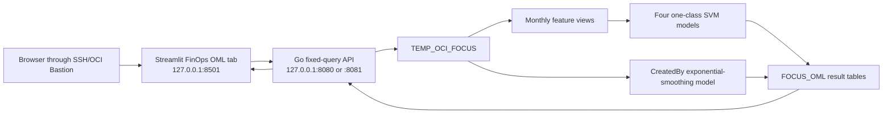

# FinOps OML analytics

This optional module adds read-only cost charts and explicitly refreshed Oracle
Machine Learning for SQL (OML4SQL) models to the modular Streamlit interface.
It analyzes the fixed `TEMP_OCI_FOCUS` table; the browser cannot submit SQL or a
table name.

> **Independent project disclaimer**
>
> This is a personal, experimental utility. It is not affiliated with,
> endorsed, certified, or supported by Oracle Corporation. Forecasts and
> anomaly scores are analytical indicators, not invoices, budgets, financial
> advice, or proof of misuse. Validate them against official OCI billing data
> and investigate business context before acting.

## Data flow



The normal monthly and year-to-date queries do not require OML. When OML is not
installed, those charts still work and the tab reports the missing capability.

## What is calculated

- Monthly cost: `SUM(NVL(EFFECTIVE_COST, 0))`, grouped by
  `TRUNC(CHARGE_PERIOD_START, 'MM')` and `BILLING_CURRENCY`.
- YTD cost: from 1 January of the year containing the latest `LOAD_DATE` through
  that last-loaded calendar day. If no `LOAD_DATE` exists, the latest
  `CHARGE_PERIOD_START` is the fallback as-of date.
- Anomalies: independent one-class SVM models for total cost, service, region,
  and `CreatedBy`. Model features include monthly effective cost, prior cost,
  three-observation moving average, change ratio, row count, calendar month,
  and currency.
- Forecast: a six-step OML exponential-smoothing forecast for the real
  `CreatedBy` value with the largest numeric YTD cost. The UI highlights steps
  1, 3, and 6 and plots the prediction plus lower/upper bounds. The last loaded
  calendar month is included even when it is partial; interpret the forecast
  cautiously until a complete month is available.

Currencies are never summed together. If the table contains more than one
currency, the top-user selection compares user/currency series by their numeric
YTD amount without currency conversion. Use a normalized-currency column before
making cross-currency business decisions.

`CreatedBy` is resolved from `TAG_SPECIAL1`, falling back to `TAG_SPECIAL3`,
which matches this project's default Oracle-tag mappings. Empty values are
reported as `(unassigned)` for anomaly analysis but excluded from the top-user
forecast. If your loader maps `Oracle-Tags.CreatedBy` to another special-tag
column, update the two documented expressions in
`sql_scripts/install_finops_oml.sql` before installation.

## 1. Database prerequisites

Use Autonomous Database 23ai/26ai or another Oracle Database edition that
supports the selected OML4SQL algorithms. The application schema must own
`TEMP_OCI_FOCUS` and receive the mining-model privilege directly, because
definer-rights stored PL/SQL does not use role-granted privileges.

As `ADMIN` or another authorized account:

```sql
GRANT CREATE MINING MODEL TO FOCUS_APP;
```

Do not grant `DBA` or use `ADMIN` as the application schema. The schema already
needs its normal table/view/procedure privileges to install this project's
objects.

Check capability before installation:

```sql
SELECT privilege
FROM session_privs
WHERE privilege = 'CREATE MINING MODEL';

SELECT COUNT(*) AS focus_rows
FROM temp_oci_focus;
```

## 2. Install the optional objects

From the project root on Oracle Linux 8, set the wallet directory and connect
with SQLcl or SQL*Plus. Both prompt for the password when it is omitted:

```bash
export TNS_ADMIN=/opt/oracle/wallet
sql -L FOCUS_APP@FOCUS_HIGH @sql_scripts/install_finops_oml.sql
```

or:

```bash
export TNS_ADMIN=/opt/oracle/wallet
sqlplus -L FOCUS_APP@FOCUS_HIGH @sql_scripts/install_finops_oml.sql
```

The installer verifies the source table and direct privilege, then creates:

- `FOCUS_OML_ANALYTICS.RUN(outlier_rate)`;
- five monthly/feature views;
- run, anomaly, forecast, top-user, and forecast-series tables.

It does not build a model during installation and never modifies
`TEMP_OCI_FOCUS`.

If a different database login will use the Streamlit tab, grant only the
required access after installation:

```sql
GRANT SELECT ON FOCUS_APP.TEMP_OCI_FOCUS TO FINOPS_READER;
GRANT SELECT ON FOCUS_APP.FOCUS_OML_RUNS TO FINOPS_READER;
GRANT SELECT ON FOCUS_APP.FOCUS_OML_ANOMALIES TO FINOPS_READER;
GRANT SELECT ON FOCUS_APP.FOCUS_OML_FORECAST TO FINOPS_READER;
GRANT SELECT ON FOCUS_APP.FOCUS_OML_TOP_USER TO FINOPS_READER;
GRANT EXECUTE ON FOCUS_APP.FOCUS_OML_ANALYTICS TO FINOPS_READER;
```

Omit the `EXECUTE` grant for a strictly read-only account that must not refresh
models.

## 3. Deploy the updated services

The installer copies the two OML SQL scripts into the protected application SQL
directory and installs pandas with Streamlit:

```bash
sudo TNS_ADMIN=/opt/oracle/wallet PYTHON_BIN=python3.11 \
  SQLPLUS_BIN=/usr/lib/oracle/23/client64/bin/sqlplus \
  ./scripts/install-streamlit-ui.sh
./scripts/test-streamlit-ui.sh
```

Open the existing Bastion tunnel and browse to the Streamlit service. Select
**FinOps OML**, enter the database login and schema owner, then choose one of:

1. Leave **Rebuild OML anomaly and forecast models** clear and select **Load
   FinOps analytics** for read-only charts and the last saved OML output.
2. Select both rebuild and confirmation, choose an expected outlier rate, and
   submit to rebuild the five `FOCUS_OML_*` models and derived result rows.

The accepted outlier-rate range is `0.001` through `0.25`; `0.05` is the
default. A refresh can consume database CPU and commits its result tables, so
run it after a load or on an approved schedule rather than on every page view.

## 4. Verify without Streamlit

Refresh once from SQL:

```sql
BEGIN
  FOCUS_OML_ANALYTICS.RUN(0.05);
END;
/
```

Inspect the run and model inventory:

```sql
SELECT run_id, run_at_utc, status, message, outlier_rate
FROM focus_oml_runs
ORDER BY run_id DESC
FETCH FIRST 5 ROWS ONLY;

SELECT model_name, mining_function, algorithm
FROM user_mining_models
WHERE model_name LIKE 'FOCUS_OML_%'
ORDER BY model_name;
```

Inspect anomalies and the six forecast steps:

```sql
SELECT dimension_type, dimension_value, cost_month, billing_currency,
       effective_cost, anomaly_probability
FROM focus_oml_anomalies
ORDER BY anomaly_probability DESC
FETCH FIRST 50 ROWS ONLY;

SELECT created_by, billing_currency, forecast_month, horizon_months,
       prediction, lower_bound, upper_bound
FROM focus_oml_forecast
ORDER BY horizon_months;
```

## 5. Roll back the optional module

First stop using the FinOps tab for model refreshes, then connect as the FOCUS
schema owner:

```bash
sql -L FOCUS_APP@FOCUS_HIGH @sql_scripts/uninstall_finops_oml.sql
```

The uninstaller drops only `FOCUS_OML_*` models, views, package, staging tables,
and result tables. It preserves `TEMP_OCI_FOCUS` and all loader/audit data. The
monthly and YTD Streamlit charts remain available after removal.

## Troubleshooting

- `ORA-01031`: grant `CREATE MINING MODEL` directly to the schema owner, not
  only through a role. A separate login also needs the explicit object grants
  shown above.
- `OML package is NOT_INSTALLED`: install in the same schema entered in the UI,
  then reconnect or submit the form again.
- An anomaly model is skipped: that dimension currently has fewer than 12
  aggregated monthly records. Load more history and refresh.
- Forecast is missing: no real `CreatedBy` value exists, or the selected
  user/currency history has fewer than six monthly observations.
- Forecast appears flat or wide: this can be a valid result of short, noisy, or
  non-seasonal history. Treat intervals as uncertainty, not a guarantee.
- `CreatedBy` is wrong: confirm the loader's `-ts1`/`-ts3` mappings and update
  the installer expressions if the tag is stored in another special column.
- Refresh times out: the API limit is five minutes. Run the package from SQL to
  capture the complete Oracle error and inspect the newest `FOCUS_OML_RUNS`
  row, then reduce data cardinality or schedule the refresh outside the UI.

Official background: Oracle documents [one-class SVM](https://docs.oracle.com/en/database/oracle/machine-learning/oml4sql/23/mlsql/one-class-svm.html)
prediction `0` as anomalous and prediction `1` as typical, with
`SVMS_OUTLIER_RATE` controlling the expected fraction. Oracle's
[exponential-smoothing model](https://docs.oracle.com/en/database/oracle/machine-learning/oml4sql/23/dmapi/expnential-smoothing.html)
supports ordered time series, prediction steps, and forecast bounds through its
model detail view.
