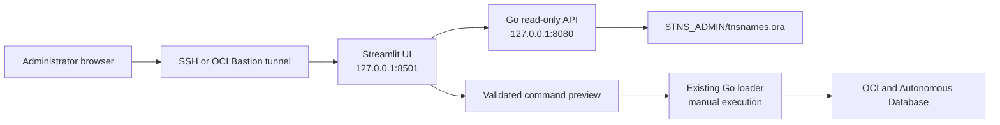

# Modular Streamlit frontend

This directory contains an optional browser frontend for the OCI FOCUS Loader.
It is deliberately separate from the Go loader so the interface can evolve
without embedding HTML, JavaScript, charts, and form logic in the Go binary.

The implementation uses Streamlit `1.60` or newer and Python `3.11`. Streamlit
currently supports Python 3.10 through 3.14; Oracle Linux 8.8 and later provide
Python 3.11 as an AppStream RPM. See the official
[Streamlit installation guide](https://docs.streamlit.io/get-started/installation/command-line)
and [Oracle Linux 8 Python guide](https://docs.oracle.com/en/operating-systems/oracle-linux/8/python/python-InstallingPython.html).

## What is implemented

- Independent Python/Streamlit process on `127.0.0.1:8501`.
- Go backend health validation through `GET /api/v1/health`.
- Ordered alias discovery through `GET /api/v1/tns/aliases`.
- Read-only display of the first TNS alias and `tnsnames.ora` source path.
- Interactive selection from every alias in the file.
- Form-based loader command builder for database load, pre-load report,
  upload-only, and upload-and-load modes.
- Instance-principal and OCI config-file authentication choices.
- Validation for required values, dates, workers, upload destinations, and
  control characters.
- POSIX-safe command quoting and shell-script download.
- Diagnostics page with local API commands and non-secret backend metadata.
- Python unit tests, Go API/parser tests, a systemd service, an automated
  installer, and a deployed-service smoke-test script.

The command builder does **not** execute the generated command. This is an
intentional security boundary. It does not accept a database password; it
accepts only a Vault secret OCID for the existing `-ds` loader option.

## Architecture



The Streamlit process never reads the wallet or `tnsnames.ora`. The Go process
owns that file access and returns only aliases, the source path, and read time.
The API URL is taken from the server-side `FOCUS_API_URL` environment variable
and cannot be changed by a browser user.

## Directory contents

```text
streamlit-ui/
├── .streamlit/config.toml       Loopback server and safe UI defaults
├── app.py                       Streamlit application
├── command_builder.py           Validated POSIX command construction
├── focus_api.py                 Dependency-free Go API client
├── requirements.txt             Runtime dependency range
├── requirements-dev.txt         Test dependencies
└── tests/
    ├── test_command_builder.py
    └── test_focus_api.py
```

Related deployment files are located in the parent repository:

```text
deploy/focus-loader-tns-gui.service.example
deploy/focus-loader-streamlit.env.example
deploy/focus-loader-streamlit.service.example
scripts/install-streamlit-ui.sh
scripts/test-streamlit-ui.sh
```

## API contract

### Health

```http
GET /api/v1/health
```

Example:

```json
{
  "status": "ok",
  "version": "26.5.4-streamlit"
}
```

### TNS alias catalog

```http
GET /api/v1/tns/aliases
```

Example:

```json
{
  "aliases": ["focusdb_high", "focusdb_low"],
  "firstAlias": "focusdb_high",
  "sourcePath": "/opt/oracle/wallet/tnsnames.ora",
  "readAtUtc": "2026-08-10T12:00:00Z"
}
```

The original `GET /api/tns-alias` endpoint remains available for compatibility
with the embedded page.

## Oracle Linux 8 prerequisites

The instructions assume:

- Oracle Linux 8.8 or newer;
- the `focusloader` service account already exists;
- the new Go binary is installed at
  `/opt/focus-loader/focus-loader-report-upload`;
- the service account can traverse the TNS directory and read
  `$TNS_ADMIN/tnsnames.ora`;
- outbound access to the approved Python package repository is available
  during installation;
- `curl`, `systemd`, and OpenSSH are installed.

Install Python 3.11 without replacing Oracle Linux platform Python:

```bash
sudo dnf install -y python3.11 python3.11-pip
python3.11 --version
```

Do not remove Python 3.6 or change operating-system scripts to use Python 3.11.
The Streamlit service explicitly uses its own Python 3.11 virtual environment.

## 1. Build and install the updated Go backend

The Streamlit frontend needs the versioned API endpoints introduced in
`26.5.4-streamlit`.

```bash
cd /opt/focus-loader/src
go mod download
go mod verify
CGO_ENABLED=1 go test ./...
CGO_ENABLED=1 go build -buildvcs=false -trimpath \
  -o dist/focus-loader-report-upload .

sudo systemctl stop focus-loader-tns-gui.service 2>/dev/null || true
sudo install -o focusloader -g focusloader -m 0750 \
  dist/focus-loader-report-upload \
  /opt/focus-loader/focus-loader-report-upload
/opt/focus-loader/focus-loader-report-upload -version
```

Expected version:

```text
focus-loader-report-upload 26.5.4-streamlit
```

## 2. Verify TNS permissions

Set the actual wallet or Oracle Network configuration directory:

```bash
export TNS_ADMIN=/opt/oracle/wallet
sudo -u focusloader env TNS_ADMIN="$TNS_ADMIN" \
  test -r "$TNS_ADMIN/tnsnames.ora"
```

If this fails, inspect every directory component:

```bash
sudo -u focusloader namei -l "$TNS_ADMIN/tnsnames.ora"
```

Grant only the required group traversal/read permissions. Do not make a wallet
world-readable.

For the common case where `TNS_ADMIN=/home/oracle/adb_wallet` remains owned by
`oracle`, install the ACL tools and grant access only to the named file:

```bash
sudo dnf install -y acl

sudo chmod 0700 /home/oracle/adb_wallet
sudo chmod 0600 /home/oracle/adb_wallet/tnsnames.ora

# Allow focusloader to traverse the two directories.
sudo setfacl -m u:focusloader:--x /home/oracle
sudo setfacl -m u:focusloader:--x /home/oracle/adb_wallet

# Allow reading only tnsnames.ora.
sudo setfacl -m u:focusloader:r-- \
  /home/oracle/adb_wallet/tnsnames.ora
```

Verify the resulting access:

```bash
sudo -u focusloader test -r /home/oracle/adb_wallet/tnsnames.ora
sudo -u focusloader head -n 1 /home/oracle/adb_wallet/tnsnames.ora
sudo getfacl -p /home/oracle /home/oracle/adb_wallet \
  /home/oracle/adb_wallet/tnsnames.ora
```

It is intentional that `focusloader` can traverse the wallet directory but
cannot list it, so `ls /home/oracle/adb_wallet` may still fail for that user.
This narrowly scoped ACL supports the read-only alias service. Full database
connections can require additional wallet files; grant those separately only
after reviewing the loader's runtime requirements.

## 3A. Automated installation

Review the installer before running it. It copies the UI, creates an isolated
virtual environment, installs Streamlit, installs both systemd units, and waits
for the local health endpoints.

```bash
cd /opt/focus-loader/src
less scripts/install-streamlit-ui.sh
sudo TNS_ADMIN=/opt/oracle/wallet \
  PYTHON_BIN=python3.11 \
  ./scripts/install-streamlit-ui.sh
```

Optional installer environment variables:

| Variable | Default | Purpose |
| --- | --- | --- |
| `APP_DIR` | `/opt/focus-loader` | Installed loader and UI location. |
| `SERVICE_USER` | `focusloader` | Non-root systemd account. |
| `SERVICE_GROUP` | `focusloader` | Installed file group. |
| `PYTHON_BIN` | `python3.11` | Python used to create the virtual environment. |
| `TNS_ADMIN` | `/opt/oracle/wallet` | Directory containing `tnsnames.ora`. |
| `FOCUS_API_URL` | `http://127.0.0.1:8080` | Server-side Go API URL. |

The installer does not build or replace the Go executable. Complete step 1
first.

## 3B. Manual installation

Use this alternative when package downloads and service changes must be
performed separately.

```bash
sudo install -d -o focusloader -g focusloader -m 0750 \
  /opt/focus-loader/streamlit-ui
sudo install -d -o focusloader -g focusloader -m 0750 \
  /opt/focus-loader/streamlit-ui/.streamlit

sudo install -o focusloader -g focusloader -m 0640 \
  streamlit-ui/app.py \
  streamlit-ui/focus_api.py \
  streamlit-ui/command_builder.py \
  streamlit-ui/requirements.txt \
  /opt/focus-loader/streamlit-ui/
sudo install -o focusloader -g focusloader -m 0640 \
  streamlit-ui/.streamlit/config.toml \
  /opt/focus-loader/streamlit-ui/.streamlit/config.toml
```

Create the virtual environment and install only the declared runtime packages:

```bash
sudo python3.11 -m venv /opt/focus-loader/streamlit-ui/.venv
sudo /opt/focus-loader/streamlit-ui/.venv/bin/python -m pip install --no-cache-dir --upgrade pip
sudo /opt/focus-loader/streamlit-ui/.venv/bin/python -m pip install --no-cache-dir \
  -r /opt/focus-loader/streamlit-ui/requirements.txt
sudo chown -R focusloader:focusloader /opt/focus-loader/streamlit-ui/.venv

/opt/focus-loader/streamlit-ui/.venv/bin/streamlit version
```

Create the service configuration:

```bash
sudo install -d -o root -g focusloader -m 0750 /etc/focus-loader
sudo install -o root -g focusloader -m 0640 \
  deploy/focus-loader-tns-gui.env.example \
  /etc/focus-loader/tns-gui.env
sudo install -o root -g focusloader -m 0640 \
  deploy/focus-loader-streamlit.env.example \
  /etc/focus-loader/streamlit.env

sudo vi /etc/focus-loader/tns-gui.env
sudo vi /etc/focus-loader/streamlit.env
```

Install and start the units:

```bash
sudo install -o root -g root -m 0644 \
  deploy/focus-loader-tns-gui.service.example \
  /etc/systemd/system/focus-loader-tns-gui.service
sudo install -o root -g root -m 0644 \
  deploy/focus-loader-streamlit.service.example \
  /etc/systemd/system/focus-loader-streamlit.service

sudo systemctl daemon-reload
sudo systemctl enable --now focus-loader-tns-gui.service
sudo systemctl enable --now focus-loader-streamlit.service
```

## 4. Validate on the Oracle Linux server

```bash
sudo systemctl status --no-pager focus-loader-tns-gui.service
sudo systemctl status --no-pager focus-loader-streamlit.service

curl -fsS http://127.0.0.1:8080/api/v1/health
curl -fsS http://127.0.0.1:8080/api/v1/tns/aliases
curl -fsS http://127.0.0.1:8501/_stcore/health
```

Run the complete smoke test:

```bash
chmod +x scripts/test-streamlit-ui.sh
./scripts/test-streamlit-ui.sh
```

Expected final line:

```text
All Streamlit frontend checks passed.
```

## 5. Open the UI from a workstation

Both services bind only to loopback. Create an SSH tunnel:

```bash
ssh -N -L 8501:127.0.0.1:8501 opc@SERVER_IP
```

Open:

```text
http://127.0.0.1:8501/
```

When OCI Bastion is required, add the same local-forward option to the SSH
command supplied for the active managed-SSH session. Do not open ports 8080 or
8501 in an NSG merely to reach this administrative interface.

For a shared production interface, use an authenticated reverse proxy and TLS.
Streamlit recommends terminating production TLS at a reverse proxy or load
balancer; see its [HTTPS guidance](https://docs.streamlit.io/develop/concepts/configuration/https-support).

## 6. Using the interface

### Connection tab

1. Confirm that backend status is `OK`.
2. Confirm the Go backend version.
3. Review the first TNS alias.
4. Select the database service alias to use in the command builder.
5. Expand **All aliases** when the expected service is not selected.

### Command builder tab

1. Choose the processing mode.
2. Choose instance-principal or OCI config-file authentication.
3. Enter the database username and selected TNS alias.
4. Enter the Vault secret OCID, never the password value.
5. Set source, destination, date, worker, and optional replay values.
6. Select **Validate and build command**.
7. Review the safely quoted command.
8. Download the shell script if required.
9. Review the downloaded file and execute it manually under the approved
   service account and change window.

The generated file includes `set -euo pipefail`. It is not run by Streamlit.

### Diagnostics tab

Use this page to copy local health commands and review non-secret API metadata.
It never displays the TNS descriptor, wallet contents, database password, OCI
API key, or Vault secret value.

## 7. Development and tests

Create a local virtual environment:

```bash
cd streamlit-ui
python3.11 -m venv .venv
source .venv/bin/activate
python -m pip install -r requirements-dev.txt
python -m unittest discover -s tests -v
streamlit run app.py
```

The UI expects the Go backend at `http://127.0.0.1:8080`. Override it only in
the server process environment:

```bash
FOCUS_API_URL=http://127.0.0.1:18080 streamlit run app.py
```

Go API tests from the repository root:

```bash
CGO_ENABLED=1 go test ./...
```

## 8. Logs and troubleshooting

Follow both services:

```bash
sudo journalctl -u focus-loader-tns-gui.service -f
sudo journalctl -u focus-loader-streamlit.service -f
```

### Streamlit reports that the Go backend is unavailable

```bash
sudo systemctl is-active focus-loader-tns-gui.service
curl -v http://127.0.0.1:8080/api/v1/health
sudo grep '^FOCUS_API_URL=' /etc/focus-loader/streamlit.env
```

An older `26.5.3` binary has only `/api/tns-alias`; install the
`26.5.4-streamlit` binary before starting the new frontend.

### The alias endpoint returns an error

```bash
sudo grep '^TNS_ADMIN=' /etc/focus-loader/tns-gui.env
sudo -u focusloader bash -c \
  'source /etc/focus-loader/tns-gui.env && test -r "$TNS_ADMIN/tnsnames.ora"'
```

Restart after changing the environment:

```bash
sudo systemctl restart focus-loader-tns-gui.service
sudo systemctl restart focus-loader-streamlit.service
```

### Port already in use

```bash
sudo ss -ltnp | grep -E ':(8080|8501)[[:space:]]'
```

Stop the conflicting process or deliberately update both the service and
environment settings. Do not expose the listener publicly as a shortcut.

### Python installation fails

Confirm the Oracle Linux release and repositories:

```bash
cat /etc/oracle-release
sudo dnf repolist
sudo dnf info python3.11 python3.11-pip
```

Oracle Linux 8.8 or newer is required for the documented Python 3.11 RPM path.

## 9. Upgrade and rollback

Back up configuration and capture installed versions:

```bash
sudo cp -a /etc/focus-loader /etc/focus-loader.backup.$(date +%Y%m%d%H%M%S)
/opt/focus-loader/focus-loader-report-upload -version
/opt/focus-loader/streamlit-ui/.venv/bin/streamlit version
```

For an upgrade, install the new Go binary, recopy the Streamlit files, update
the virtual environment from `requirements.txt`, then restart both services.

To disable only the new interface while retaining the loader:

```bash
sudo systemctl disable --now focus-loader-streamlit.service
```

The embedded read-only Go page remains available through port 8080 while the
Go backend service is running. Restore a previously backed-up binary and UI
directory to roll back application code.

## Security boundary

- Both listeners default to `127.0.0.1`.
- The browser cannot override the backend URL.
- Streamlit does not read the wallet or TNS file.
- The API does not return connect descriptors or wallet contents.
- The command builder never requests a database password.
- The UI generates but never executes loader commands.
- Shell arguments are represented as an argument list and POSIX-quoted.
- The services run as the unprivileged `focusloader` account with systemd
  hardening directives.
- Use an authenticated TLS reverse proxy before any shared network exposure.
- Review dependency updates and GitHub security alerts before deployment.

This is independent software and is not affiliated with, endorsed, certified,
or supported by Oracle Corporation.
