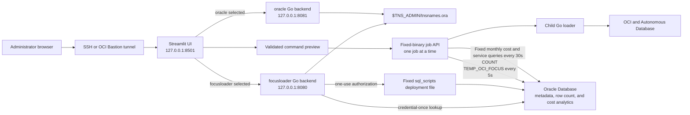

# Modular Streamlit frontend

This directory contains an optional browser frontend for the OCI FOCUS Loader.
It is deliberately separate from the Go loader so the interface can evolve
without embedding HTML, JavaScript, charts, and form logic in the Go binary.

The implementation uses Streamlit `1.60` or newer and Python `3.11`. Streamlit
currently supports Python 3.10 through 3.14; Oracle Linux 8.8 and later provide
Python 3.11 as an AppStream RPM. See the official
[Streamlit installation guide](https://docs.streamlit.io/get-started/installation/command-line)
and [Oracle Linux 8 Python guide](https://docs.oracle.com/en/operating-systems/oracle-linux/8/python/python-InstallingPython.html).

## What is implemented

- Independent Python/Streamlit process on `127.0.0.1:8501`.
- Sidebar execution-user selector for isolated `focusloader` and `oracle`
  backends on `127.0.0.1:8080` and `127.0.0.1:8081`.
- Go backend health validation through `GET /api/v1/health`.
- Ordered alias discovery through `GET /api/v1/tns/aliases`.
- First-tab database connection using the first TNS alias, an editable Oracle
  user (default `ADMIN`), a masked password field, and an optional schema owner.
- Read-only schema-table discovery through `POST /api/v1/database/tables` and
  CSV download of the returned owner/table names.
- A second **Deploy schema** tab that appears only after the first tab verifies
  the database login. It runs the fixed
  `sql_scripts/run_deploy_focus_schema_with_sqlloader_audit.sh` wrapper, shows
  its redacted exports, command, and combined console result, provides the
  execution log as a download, reconnects with the submitted target-schema
  password, and lists every table in the created schema.
- Read-only display of the first TNS alias and `tnsnames.ora` source path.
- Interactive selection from every alias in the file.
- Form-based loader command builder with direct database password as the default
  and OCI Vault secret OCID/profile as the alternative.
- Editable fields for every value in the documented pre-load example, including
  OCI profile, user, alias, namespace, date, workers, and `-ts1` through `-ts4`.
- Explicit checkboxes for pre-load, continuation, metadata-only scanning,
  upload/load, force, tag skips, work-file retention, and verbose CLI flags.
- The pre-load report, metadata-only scan, tag-row skip, and continue-after-report
  flags are selected by default.
- Instance-principal and OCI config/profile authentication choices, plus
  validation for required values, flag interactions, dates, workers, upload
  destinations, and control characters.
- POSIX-safe command quoting and shell-script download.
- A separate **Execute loader** tab that starts one validated job through the
  fixed backend executable and refreshes `TEMP_OCI_FOCUS` total/delta metrics
  every five seconds. It empties only that selected backend user's fixed
  `work_report_dir`, streams combined stdout/stderr plus process diagnostics,
  and offers the captured execution log as a download.
- Installed backend release information and a GitHub release-history link on
  both the main page and execution-identity sidebar.
- A **Cost analytics** tab that refreshes monthly `EFFECTIVE_COST` totals and
  the unique `SERVICE_NAME` list while committed loader rows become visible.
  Zero rows produce empty analytics and never prevent the loader from starting.
- A standalone **FinOps OML** tab with a monthly cost chart, per-currency YTD
  totals through the last loaded date, optional one-class SVM anomalies for
  total cost/service/region/`CreatedBy`, and a six-month exponential-smoothing
  forecast for the most expensive tagged user. Model rebuilds require explicit
  confirmation; monthly/YTD charts work without OML.
- A **Schema stats** tab that checks a validated schema's fixed
  `TEMP_OCI_FOCUS` table for existence, data, total rows, latest `LOAD_DATE`,
  and current-month cost totals grouped by billing currency.
- A sidebar **Reset interface** button that clears UI state without cancelling
  a loader process already running in the backend.
- Diagnostics page with local API commands and non-secret backend metadata.
- Python unit tests, Go API/parser tests, a systemd service, an automated
  installer, and a deployed-service smoke-test script.

The command builder does not execute by itself. For direct-password
authentication, it validates a masked field but places only a redacted marker
in the preview; the downloaded script prompts again with terminal echo disabled
and never contains the submitted value. The separate execution tab requests the
password again and submits structured fields to the loopback Go API. The API
passes the password to the fixed child loader through standard input, not its
arguments. Vault mode emits `-ds` and optional `-dst`. After a successful
first-tab connection, the Go backend retains
the administrator credentials only in memory behind a random, 15-minute,
one-use deployment token. Streamlit stores only that opaque token, never the
password. All password forms are masked and cleared; passwords are never logged,
written to a configuration file by the web application, or returned by the API.

## Architecture



The Streamlit process never reads the wallet or `tnsnames.ora`. The selected Go process
owns Oracle Net access. Alias responses contain only aliases, source path, and
read time. For a table lookup, Streamlit sends the submitted credentials to the
loopback-only Go API; the Go process uses the first alias, executes a fixed
bind-variable query against `ALL_TABLES`, returns owner/table names, and closes
the connection. A successful lookup also creates one short-lived deployment
authorization. The deployment API loads only the server-configured wrapper,
passes both passwords to it through an anonymous inherited file descriptor
instead of command arguments or its initial environment, and the wrapper
exports them only to its fixed child deployment script. Both passwords are
redacted from output. The API then uses the new schema's password for the final
fixed table query. The loader
job API separately revalidates builder fields, starts only the configured
binary, and uses fixed current-schema row-count and analytics SQL while the job
runs. Cost totals are grouped by `CHARGE_PERIOD_START` month and
`BILLING_CURRENCY`; unique services come from `SERVICE_NAME`. The API
URLs come from server-side environment variables and cannot be changed by a
browser user. Changing the execution identity clears database authorization,
schema results, built commands, and loader-job state so credentials/results
cannot cross the two Unix-user boundaries.

## Directory contents

```text
streamlit-ui/
|-- .streamlit/config.toml       Loopback server and safe UI defaults
|-- app.py                       Streamlit application
|-- command_builder.py           Validated POSIX command construction
|-- focus_api.py                 Dependency-free Go API client
|-- requirements.txt             Runtime dependency range
|-- requirements-dev.txt         Test dependencies
`-- tests/
    |-- test_app_smoke.py
    |-- test_command_builder.py
    `-- test_focus_api.py
```

Related deployment files are located in the parent repository:

```text
deploy/focus-loader-tns-gui.service.example
deploy/focus-loader-tns-gui-oracle.service.example
deploy/focus-loader-streamlit.env.example
deploy/focus-loader-streamlit.service.example
scripts/copy-oracle-oci-config-to-focusloader.sh
scripts/install-streamlit-ui.sh
scripts/test-streamlit-ui.sh
```

## API contract

### Health

```http
GET /api/v1/health
```

Example:

```json
{
  "status": "ok",
  "version": "26.17.0-finops-oml"
}
```

### TNS alias catalog

```http
GET /api/v1/tns/aliases
```

Example:

```json
{
  "aliases": ["focusdb_high", "focusdb_low"],
  "firstAlias": "focusdb_high",
  "sourcePath": "/opt/oracle/wallet/tnsnames.ora",
  "readAtUtc": "2026-08-10T12:00:00Z"
}
```

The original `GET /api/tns-alias` endpoint remains available for compatibility
with the embedded page.

### Database schema tables

```http
POST /api/v1/database/tables
Content-Type: application/json
```

Request body:

```json
{
  "username": "ADMIN",
  "password": "submitted-only-at-runtime",
  "schema": "FOCUS_APP"
}
```

The API always uses `firstAlias`; the browser cannot supply a different connect
descriptor. It does not execute caller-supplied SQL and needs no pre-existing
SQL file. The built-in query is equivalent to:

```sql
SELECT OWNER, TABLE_NAME
FROM ALL_TABLES
WHERE OWNER = :schema_owner
ORDER BY TABLE_NAME;
```

Example response:

```json
{
  "connectAlias": "focusdb_high",
  "username": "ADMIN",
  "schema": "FOCUS_APP",
  "deploymentToken": "opaque-one-use-value",
  "deploymentTokenExpiresAtUtc": "2026-08-10T12:15:00Z",
  "tableCount": 2,
  "tables": [
    {"owner": "FOCUS_APP", "tableName": "LOAD_STATUS"},
    {"owner": "FOCUS_APP", "tableName": "OCI_FOCUS"}
  ]
}
```

Treat the token as transient authentication data. It is accepted once by the
deployment endpoint and is then removed from backend memory, whether the script
succeeds or fails.

### FOCUS schema deployment

```http
POST /api/v1/schema/deploy
Content-Type: application/json
```

Request body:

```json
{
  "deploymentToken": "opaque-one-use-value",
  "targetSchema": "FOCUS_APP",
  "targetSchemaPassword": "submitted-only-at-runtime",
  "dropExisting": false
}
```

The backend supplies `TNS_ADMIN`, the first TNS alias, the authenticated
administrator user/password, fixed working and parent `focus.conf` paths, and
the fixed wrapper path. The browser cannot select another shell script, TNS
directory, alias, or configuration path. The form's `dropExisting` checkbox is
the only deletion confirmation; when selected, the fixed script locks the
target user, disconnects its active sessions, and drops the existing schema and
all its objects before recreating it.
Common administrative schemas and the authenticated login schema are rejected
as deployment targets.

The response includes the script exit code, start/finish timestamps, working
directory, password-redacted effective exports and command, up to 2 MiB of
redacted combined output, `outputTruncated`, deployment/table-lookup status, and
the tables found by logging in as the created schema with the submitted target
password. A script failure is returned as a structured result so its console
output remains visible and downloadable as a text log.

### Loader execution jobs

```http
POST /api/v1/loader/jobs
Content-Type: application/json
```

The request is a structured copy of the validated builder fields. It includes
the database user/alias, one runtime credential, OCI authentication settings,
source and destination values, workers, tag fields, and individual booleans for
each supported flag. It does not include an executable or shell command. The
backend requires the alias to exist in its TNS catalog and launches only
`FOCUS_LOADER_EXECUTABLE` from `FOCUS_LOADER_WORK_DIR`.

The four normal pre-load booleans are:

```json
{
  "preloadReport": true,
  "skipPreloadContentScan": true,
  "skipTagRows": true,
  "continueAfterReport": true
}
```

A successful start returns HTTP `202` with an opaque `jobId`. Poll it with:

```http
GET /api/v1/loader/jobs/<jobId>
```

List durable summaries and discover the active job after a reconnect with:

```http
GET /api/v1/loader/jobs
```

The response reports `starting`, `running`, `succeeded`, `failed`, `timed_out`,
or restored `interrupted`; creation/start/finish times; exit code; up to 8 MiB
of combined, redacted
stdout/stderr; `outputTruncated`; and
`initialRowCount`, `currentRowCount`, and `rowsInserted` values with availability
flags. `rowsInserted` is the current `TEMP_OCI_FOCUS` count minus the count read
immediately before the child loader starts. Oracle commits become visible on
subsequent five-second polls. The same response includes `monthlyCosts`,
`services`, `analyticsUpdatedAtUtc`, and `analyticsError`. The backend refreshes
analytics every 30 seconds while the job runs and once after it finishes.
Monthly entries contain `month`, `billingCurrency`, and a decimal-string
`effectiveCost`; preserving the value as a string avoids binary floating-point
rounding. When the committed row count is zero, the backend returns empty
arrays and skips both analytics queries until rows become visible. Missing or
`null` analytics fields from a transitional backend are also interpreted as an
empty not-yet-populated snapshot. It also returns `executable`,
`workingDirectory`, `commandLine`, `manualCommand`, `tnsAdmin`, `homeDirectory`,
`pathEnvironment`, `workReportDirectory`, `workReportResetAtUtc`, and
`lastFilesLoaded`. The
direct-password manual command contains a hidden
prompt and `-dp-stdin`, never the credential. Only one loader job can run at a
time and jobs time out after 24 hours. Password-free snapshots are persisted in
`work_report_dir/.loader_job_history`; `GET /api/v1/loader/jobs` returns the
active job ID and newest-first history so a new Streamlit session can reconnect.
Records are not expired automatically; monitor this directory and apply an
operator-approved retention policy if long-term bounded-log storage is not
required.

`POST /api/v1/schema/stats` accepts the same `username`, `password`, and
validated `schema` fields as the table-list request. The backend always uses
the first TNS alias and fixed `SCHEMA.TEMP_OCI_FOCUS` table. Its response
contains `tableExists`, `hasData`, `totalRows`, `lastLoadDate`, `currentMonth`,
`currentMonthCosts`, and `queriedAtUtc`. Current-month costs remain separated
by `billingCurrency`.

`POST /api/v1/analytics/finops` accepts `username`, `password`, validated
`schema`, `refreshOml`, `confirmOmlRefresh`, and an `outlierRate` from `0.001`
through `0.25`. The first three fields select a login and fixed
`SCHEMA.TEMP_OCI_FOCUS`; no SQL, table, view, package, or model name is accepted.
Without refresh it runs fixed read-only monthly/YTD queries and reads saved OML
results when installed. A rebuild runs only the fixed
`SCHEMA.FOCUS_OML_ANALYTICS.RUN` package and is rejected unless both refresh and
confirmation are true. Decimal database values remain JSON strings. The full
response contains `monthlyCosts`, `yearToDateCosts`, `anomalies`, `forecasts`,
top-user context, and OML install/run/model status.

## Oracle Linux 8 prerequisites

The instructions assume:

- Oracle Linux 8.8 or newer;
- the `focusloader` service account already exists;
- the `oracle` account, `/home/oracle/.oci/config`, and the complete repository
  at `/home/oracle/focus-loader-report-upload` already exist;
- the new Go binary has been built as
  `/home/oracle/focus-loader-report-upload/dist/focus-loader-report-upload-linux-amd64`;
- the service account can traverse the TNS directory, read
  `$TNS_ADMIN/tnsnames.ora`, and read the Oracle Net/wallet files required for
  a real connection (commonly `sqlnet.ora` and `cwallet.sso` for an ADB wallet);
- outbound access to the approved Python package repository is available
  during installation;
- Oracle SQL*Plus is installed and executable by both users;
- `/opt/focus-loader/focus.conf` exists and is writable by `focusloader` so a
  successful schema deployment can synchronize the loader configuration;
- `curl`, `systemd`, and OpenSSH are installed.

Install Python 3.11 without replacing Oracle Linux platform Python:

```bash
sudo dnf install -y python3.11 python3.11-pip
python3.11 --version
```

Do not remove Python 3.6 or change operating-system scripts to use Python 3.11.
The Streamlit service explicitly uses its own Python 3.11 virtual environment.

## 1. Build and install the updated Go backend

The execution, cost, and schema-statistics tabs require the
`26.17.0-finops-oml` Go API and UI to be installed together.

```bash
cd /home/oracle/focus-loader-report-upload
go mod download
go mod verify
CGO_ENABLED=1 go test ./...
CGO_ENABLED=1 go build -buildvcs=false -trimpath \
  -o dist/focus-loader-report-upload-linux-amd64 .
chmod 0750 dist/focus-loader-report-upload-linux-amd64
dist/focus-loader-report-upload-linux-amd64 -version
```

Expected version:

```text
focus-loader-report-upload 26.17.0-finops-oml
```

## 2. Verify TNS permissions

Set the actual wallet or Oracle Network configuration directory:

```bash
export TNS_ADMIN=/opt/oracle/wallet
sudo -u focusloader env TNS_ADMIN="$TNS_ADMIN" \
  test -r "$TNS_ADMIN/tnsnames.ora"
```

If this fails, inspect every directory component:

```bash
sudo -u focusloader namei -l "$TNS_ADMIN/tnsnames.ora"
```

Grant only the required group traversal/read permissions. Do not make a wallet
world-readable.

For the common case where `TNS_ADMIN=/home/oracle/adb_wallet` remains owned by
`oracle`, install the ACL tools and grant access to the alias plus the minimum
Oracle Net files needed by the schema browser:

```bash
sudo dnf install -y acl

sudo chmod 0700 /home/oracle/adb_wallet
sudo chmod 0600 /home/oracle/adb_wallet/tnsnames.ora
sudo chmod 0600 /home/oracle/adb_wallet/sqlnet.ora
sudo chmod 0600 /home/oracle/adb_wallet/cwallet.sso

# Allow focusloader to traverse the two directories.
sudo setfacl -m u:focusloader:--x /home/oracle
sudo setfacl -m u:focusloader:--x /home/oracle/adb_wallet

# Allow reading the alias and the common ADB mTLS runtime files.
sudo setfacl -m u:focusloader:r-- \
  /home/oracle/adb_wallet/tnsnames.ora \
  /home/oracle/adb_wallet/sqlnet.ora \
  /home/oracle/adb_wallet/cwallet.sso
```

Verify the resulting access:

```bash
sudo -u focusloader test -r /home/oracle/adb_wallet/tnsnames.ora
sudo -u focusloader test -r /home/oracle/adb_wallet/sqlnet.ora
sudo -u focusloader test -r /home/oracle/adb_wallet/cwallet.sso
sudo -u focusloader head -n 1 /home/oracle/adb_wallet/tnsnames.ora
sudo getfacl -p /home/oracle /home/oracle/adb_wallet \
  /home/oracle/adb_wallet/tnsnames.ora
```

It is intentional that `focusloader` can traverse the wallet directory but
cannot list it, so `ls /home/oracle/adb_wallet` may still fail for that user.
Wallet contents vary; if Oracle Net reports another required file, review that
file and grant read access explicitly rather than making the directory
world-readable.

## 3A. Automated installation

Review the installer before running it. It installs the focusloader binary when
needed, copies the UI and both fixed deployment scripts, creates an isolated virtual
environment and work directories, installs Streamlit plus both Go backend
services, verifies SQL*Plus/configuration access, and waits for all three local
health endpoints.

It also copies every regular file and directory from `/home/oracle/.oci` to the
actual focusloader home returned by `getent passwd` (normally
`/home/focusloader/.oci`). Destination directories are `0700`, files are
`0600`, and ownership is `focusloader:focusloader`. In the copied `config`,
`key_file` and `security_token_file` entries are rewritten to absolute paths
under `/home/focusloader/.oci`. Symlinks/special files and missing rewritten key
targets cause a safe failure. Existing unrelated target files are not deleted.

To refresh only the OCI copy later, run:

```bash
sudo ./scripts/copy-oracle-oci-config-to-focusloader.sh
sudo -u focusloader test -r /home/focusloader/.oci/config
sudo -u focusloader awk -F= \
  '/^(key_file|security_token_file)=/ {print $1 "=" $2}' \
  /home/focusloader/.oci/config
```

The last command prints paths only, never private-key contents. Re-run it after
the oracle profile gains a new key or session-token file; the copy is a
point-in-time snapshot, not an automatic credential synchronizer.

```bash
cd /home/oracle/focus-loader-report-upload
less scripts/install-streamlit-ui.sh
sudo TNS_ADMIN=/opt/oracle/wallet \
  PYTHON_BIN=python3.11 \
  SQLPLUS_BIN=/usr/lib/oracle/23/client64/bin/sqlplus \
  ./scripts/install-streamlit-ui.sh
```

Optional installer environment variables:

| Variable | Default | Purpose |
| --- | --- | --- |
| `PYTHON_BIN` | `python3.11` | Python used to create the virtual environment. |
| `TNS_ADMIN` | `/opt/oracle/wallet` | Directory containing `tnsnames.ora`. |
| `SQLPLUS_BIN` | First `sqlplus` in root's `PATH` | Absolute SQL*Plus executable used to build the service `PATH`. |

The service identities, API ports, and executable locations are fixed security
boundaries: `focusloader` uses `/opt/focus-loader/focus-loader-report-upload`
on port 8080; `oracle` uses
`/home/oracle/focus-loader-report-upload/dist/focus-loader-report-upload-linux-amd64`
on port 8081. Complete step 1 first.

## 3B. Manual installation

Use this alternative when package downloads and service changes must be
performed separately.

```bash
sudo install -d -o focusloader -g focusloader -m 0750 \
  /opt/focus-loader/streamlit-ui
sudo install -d -o focusloader -g focusloader -m 0750 \
  /opt/focus-loader/streamlit-ui/.streamlit
sudo install -d -o root -g focusloader -m 0750 \
  /opt/focus-loader/sql_scripts
sudo install -d -o focusloader -g focusloader -m 0750 \
  /opt/focus-loader/work_report_dir

sudo install -o focusloader -g focusloader -m 0640 \
  streamlit-ui/app.py \
  streamlit-ui/focus_api.py \
  streamlit-ui/command_builder.py \
  streamlit-ui/requirements.txt \
  /opt/focus-loader/streamlit-ui/
sudo install -o focusloader -g focusloader -m 0640 \
  streamlit-ui/.streamlit/config.toml \
  /opt/focus-loader/streamlit-ui/.streamlit/config.toml
sudo install -o root -g focusloader -m 0750 \
  sql_scripts/run_deploy_focus_schema_with_sqlloader_audit.sh \
  sql_scripts/deploy_focus_schema_with_sqlloader_audit.sh \
  /opt/focus-loader/sql_scripts/
sudo install -o focusloader -g focusloader -m 0640 \
  sql_scripts/focus.conf /opt/focus-loader/sql_scripts/focus.conf
sudo -u focusloader test -w /opt/focus-loader/focus.conf
sudo -u focusloader test -w /opt/focus-loader/work_report_dir
```

Create the virtual environment and install only the declared runtime packages:

```bash
sudo python3.11 -m venv /opt/focus-loader/streamlit-ui/.venv
sudo /opt/focus-loader/streamlit-ui/.venv/bin/python -m pip install --no-cache-dir --upgrade pip
sudo /opt/focus-loader/streamlit-ui/.venv/bin/python -m pip install --no-cache-dir \
  -r /opt/focus-loader/streamlit-ui/requirements.txt
sudo chown -R focusloader:focusloader /opt/focus-loader/streamlit-ui/.venv

/opt/focus-loader/streamlit-ui/.venv/bin/streamlit version
```

Create the service configuration:

```bash
sudo install -d -o root -g focusloader -m 0750 /etc/focus-loader
sudo install -o root -g focusloader -m 0640 \
  deploy/focus-loader-tns-gui.env.example \
  /etc/focus-loader/tns-gui.env
sudo install -o root -g focusloader -m 0640 \
  deploy/focus-loader-streamlit.env.example \
  /etc/focus-loader/streamlit.env

sudo vi /etc/focus-loader/tns-gui.env
sudo vi /etc/focus-loader/streamlit.env
```

Install and start the units:

```bash
sudo install -o root -g root -m 0644 \
  deploy/focus-loader-tns-gui.service.example \
  /etc/systemd/system/focus-loader-tns-gui.service
sudo install -o root -g root -m 0644 \
  deploy/focus-loader-streamlit.service.example \
  /etc/systemd/system/focus-loader-streamlit.service

sudo systemctl daemon-reload
sudo systemctl enable --now focus-loader-tns-gui.service
sudo systemctl enable --now focus-loader-streamlit.service
```

## 4. Validate on the Oracle Linux server

```bash
sudo systemctl status --no-pager focus-loader-tns-gui.service
sudo systemctl status --no-pager focus-loader-streamlit.service

curl -fsS http://127.0.0.1:8080/api/v1/health
curl -fsS http://127.0.0.1:8080/api/v1/tns/aliases
curl -fsS http://127.0.0.1:8501/_stcore/health
```

Run the complete smoke test:

```bash
chmod +x scripts/test-streamlit-ui.sh
./scripts/test-streamlit-ui.sh
```

Expected final line:

```text
All Streamlit frontend checks passed.
```

## 5. Open the UI from a workstation

Both services bind only to loopback. Create an SSH tunnel:

```bash
ssh -N -L 8501:127.0.0.1:8501 opc@SERVER_IP
```

Open:

```text
http://127.0.0.1:8501/
```

When OCI Bastion is required, add the same local-forward option to the SSH
command supplied for the active managed-SSH session. Do not open ports 8080 or
8501 in an NSG merely to reach this administrative interface.

For a shared production interface, use an authenticated reverse proxy and TLS.
Streamlit recommends terminating production TLS at a reverse proxy or load
balancer; see its [HTTPS guidance](https://docs.streamlit.io/develop/concepts/configuration/https-support).

## 6. Using the interface

Before using a tab, choose **focusloader** or **oracle** in the sidebar. Every
database, schema-deployment, and loader-execution request goes only to the
loopback backend running as that selected account. Switching accounts clears
previous authentication and execution state and changes the command builder's
default executable path.

### Database tables tab (first tab)

1. Confirm the displayed first TNS alias.
2. Enter `ADMIN` or another unquoted Oracle database user.
3. Keep **List the login user's schema** selected, or clear it and enter an
   accessible schema owner such as `FOCUS_APP`.
4. Enter the password in the masked field.
5. Select **Connect and list tables**.
6. Review or download the owner/table list. The password field clears and the
   backend connection closes after this request.

This tab does not accept SQL text and does not need a `.sql` file.

### Deploy schema tab (second tab after successful login)

1. Successfully connect in **Database tables**. The second tab then appears.
2. Confirm the loaded administrator user, first alias, and fixed script name.
3. Enter the target schema and its password twice.
4. Leave **Drop the existing target schema** disabled to preserve an existing
   user. The deployment DDL is not idempotent, so an existing set of tables can
   still cause the script to fail.
5. To replace a schema, select **Drop the existing target schema and all its
   objects**. The deployment locks the target user, disconnects its active
   sessions across database instances, retries while Oracle completes session
   cleanup, and then runs `DROP USER ... CASCADE` before schema creation.
6. Select **Run schema deployment** and wait for the console result.
7. Review the exit code, working directory, password-redacted exports and
   command, combined stdout/stderr, and table list obtained by connecting as the
   target schema with the same target password.
8. Select **Download deployment execution log** to save the same diagnostics.
   The log never contains either submitted password and explicitly says when
   its bounded console capture was truncated.

The authorization is one-use. Authenticate in the first tab again before each
additional deployment. Closing/restarting the Go service also invalidates it.

### Connection tab

1. Confirm that backend status is `OK`.
2. Confirm the Go backend version.
3. Review the first TNS alias.
4. Select the database service alias to use in the command builder.
5. Expand **All aliases** when the expected service is not selected.

### Command builder tab

1. Choose **OCI config/profile** to emit `-t DEFAULT` and optional `-c`, or
   choose **Instance principal** to emit `-ip`.
2. Keep the default **Database password** mode for `-dp`, or choose
   **OCI Vault secret** for `-ds` and optional `-dst`.
3. Enter the database user, selected alias, and the credential required by the
   selected database-authentication mode.
4. Edit namespace, starting date, worker count, exact object, and optional
   source bucket values.
5. Review or edit all four special-tag text fields.
6. Set upload destination values when enabling the upload checkbox.
7. Select each required CLI flag in **Flags**. The defaults reproduce the
   requested command: `-preload-report`, `-skip-preload-content-scan`,
   `-skip-tag-rows`, and `-continue-after-report` are selected.
8. Select **Validate and build command** and review the safely quoted preview.
9. Download the shell script for manual operation, or continue to **Execute
   loader** to run the same validated non-secret settings through the backend.

The generated file includes `set -euo pipefail`. In direct-password mode the
preview shows `[DATABASE_PASSWORD_PROMPT]` and the downloaded script uses a
hidden terminal prompt before supplying `-dp`; the submitted field value is not
stored in either artifact. Once executed, the loader's `-dp` argument may still
be visible to same-host process inspection. Use the direct-password script only
interactively on a controlled host; prefer OCI Vault for scheduled/shared runs.
The downloaded script is never run automatically.

### Execute loader tab

1. Validate the command in **Command builder** first.
2. Review the redacted command, selected database user/alias, authentication
   mode, and worker count.
3. For direct authentication, enter the database password again. For Vault
   authentication, confirm the displayed mode; the backend resolves the secret.
4. Select **Execute the validated loader job**, then select **Start loader
   execution**.
5. The selected backend empties exactly its fixed `work_report_dir` before the
   process starts: `/opt/focus-loader/work_report_dir` for `focusloader`, or
   `/home/oracle/focus-loader-report-upload/work_report_dir` for `oracle`.
   This deletes prior local checkpoints, reports, SQL*Loader logs, and retained
   work files in that directory. It never deletes the application directory.
6. While the page is open, the status fragment refreshes every five seconds and
   shows job state, `TEMP_OCI_FOCUS` total rows, and rows inserted since the
   baseline captured immediately before execution. You may close the browser or
   lose the Bastion tunnel: the systemd backend continues the loader without
   `nohup`, and Streamlit resumes the active job after reconnection.
7. Expand **Execution command and diagnostics** to see the exact command used
   by the backend, executable, working directory, `HOME`, `TNS_ADMIN`, `PATH`,
   timestamps, exit code, and output-truncation status.
8. Copy the generated one-line manual command to reproduce the run as the
   selected Linux user. Password mode prompts invisibly and uses `-dp-stdin`;
   the password never appears in the displayed command or process arguments.
9. Review **Full loader execution log** while the process runs. It includes the
   backend error and live combined stdout/stderr, plus a diagnostic header and
   process trailer. The capture limit is 8 MiB and the UI reports when it was
   exceeded. Select **Download full loader execution log** to save it.
10. Use **Persistent execution history** to review time, schema, last known
    state, row counts, rows inserted, and last loaded files. Choose a recorded
    job and select **Open selected loader job** to restore its complete bounded
    diagnostics and download.

The Go service runs only `FOCUS_LOADER_EXECUTABLE` with structured arguments and
`FOCUS_LOADER_WORK_DIR`; it ignores the executable text used by the preview.
Direct passwords travel over the loopback POST request and child stdin, never a
process argument. Only one job can be active. The count reflects committed rows,
so it can advance in batches after SQL*Loader commits rather than on every CSV
record.

### Cost analytics tab

1. Start a job from **Execute loader**.
2. Open **Cost analytics**. The UI polls the existing opaque job result every
   ten seconds; the backend recomputes its database snapshot every 30 seconds.
3. Review the monthly table. Each row contains the charge month, billing
   currency, and total effective cost for all currently committed
   `TEMP_OCI_FOCUS` rows.
4. Review the sorted, unique service-name table and the current loaded-row
   metric.
5. After the loader finishes, its password-free final snapshot and bounded log
   remain in persistent history. A backend restart reloads the records; a job
   that was active during that backend restart is shown as `interrupted` with
   its last persisted counters and filenames.

The tab is intentionally tied to the current or most recent GUI-started loader
job, so it reuses only the credential already held by the active backend row
monitor. It has no password field and cannot submit SQL, a table name, a schema,
or another connection alias. If multiple billing currencies exist, they remain
separate; the UI never adds unlike currencies together. Rows with a null
`CHARGE_PERIOD_START` are excluded, null `EFFECTIVE_COST` values count as zero,
and null/blank `SERVICE_NAME` values are omitted. If `TEMP_OCI_FOCUS` contains
zero committed rows, both tables remain empty and the loader continues normally;
analytics begin automatically after the row monitor sees the first commit.

### Schema stats tab

1. Open **Schema stats** and enter a database login.
2. Keep **Check the login user's schema** selected, or enter another schema
   that the login is authorized to read.
3. Enter the password and choose **Check schema statistics**.
4. Review whether `TEMP_OCI_FOCUS` exists and contains data, its total rows,
   maximum `LOAD_DATE`, and the current database month's total
   `EFFECTIVE_COST` for each billing currency.

This is a manual snapshot because the password is not stored for background
refresh. Run the check again to refresh it. The browser cannot submit SQL or a
table name. The backend validates the schema identifier, runs fixed read-only
queries, closes the connection, and redacts the password from errors.

### FinOps OML tab

1. Install the optional database objects once as the FOCUS schema owner with
   `sql -L FOCUS_APP@FOCUS_HIGH @sql_scripts/install_finops_oml.sql`.
2. Open **FinOps OML**, enter a database login, and either use its schema or
   provide the owner of `TEMP_OCI_FOCUS`.
3. Submit without selecting rebuild to read monthly cost, per-currency YTD cost
   through the latest loaded date, and any previously saved OML output.
4. To refresh, choose an expected outlier rate from `0.001` through `0.25`,
   select both rebuild and confirmation, and submit. This recreates only fixed
   `FOCUS_OML_*` models and replaces their derived output rows.
5. Filter anomaly results between total cost, services, regions, and users from
   the `CreatedBy` tag. Review the most expensive tagged user's six forecast
   steps, including the emphasized 1-, 3-, and 6-month values and bounds.

Currencies remain separate, and anomaly/forecast output is an analytical aid,
not billing truth. The full privilege model, SQL verification, `CreatedBy`
mapping, model behavior, rollback, and troubleshooting instructions are in the
[FinOps OML guide](../docs/FINOPS_OML.md).

### Reset interface button

Use **Reset interface** in the sidebar to clear forms, database authorization,
command-builder values/results, loader-job references, statistics, and other
Streamlit session state. This resets only the browser interface. An active
loader job continues in the backend and is rediscovered automatically from
durable history when **Execute loader** renders again.

### Diagnostics tab

Use this page to copy local health commands and review non-secret API metadata.
It never displays the TNS descriptor, wallet contents, database password, OCI
API key, or Vault secret value.

## 7. Development and tests

Create a local virtual environment:

```bash
cd streamlit-ui
python3.11 -m venv .venv
source .venv/bin/activate
python -m pip install -r requirements-dev.txt
python -m unittest discover -s tests -v
streamlit run app.py
```

The UI expects the Go backend at `http://127.0.0.1:8080`. Override it only in
the server process environment:

```bash
FOCUS_API_URL=http://127.0.0.1:18080 streamlit run app.py
```

Go API tests from the repository root:

```bash
CGO_ENABLED=1 go test ./...
```

## 8. Redeploy the latest Streamlit distribution

Use this complete procedure after a new version is pushed to GitHub. The
commands assume the repository is `/home/oracle/focus-loader-report-upload`,
the wallet is `/home/oracle/adb_wallet`, the Streamlit service runs as
`focusloader`, and the second Go backend runs as `oracle`. Run repository and Go
commands as `oracle`; use `sudo` only where shown.

### 8.1 Record the current version and back up installed configuration

```bash
cd /home/oracle/focus-loader-report-upload
redeploy_stamp=$(date +%Y%m%d%H%M%S)
backup_dir="/home/oracle/focus-loader-redeploy-backup.${redeploy_stamp}"
install -d -m 0700 "${backup_dir}"
sudo cp -a /etc/focus-loader "${backup_dir}/etc-focus-loader"
sudo cp -a /opt/focus-loader/focus.conf \
  "${backup_dir}/opt-focus.conf"
cp -a focus.conf "${backup_dir}/oracle-focus.conf"
cp -a sql_scripts/focus.conf "${backup_dir}/oracle-sql-scripts-focus.conf"
sudo chown -R oracle:"$(id -gn oracle)" "${backup_dir}"
git status --short
git log -1 --oneline
```

Do not continue blindly when `git status` shows tracked local changes. Review
and commit or stash them first. In particular, preserve both deployed
`focus.conf` files; they can contain environment-specific schema/table values.
Do not use `git clean` in a deployment checkout because untracked configuration
or credential files may be present.

### 8.2 Pull the release from GitHub

```bash
cd /home/oracle/focus-loader-report-upload
git fetch origin
git pull --ff-only origin main
git log -1 --oneline
git status --short
```

If the pull reports a conflict, stop and preserve the local files shown by Git.
Do not run `git reset --hard` until the required configuration has been backed
up and intentionally restored.

### 8.3 Install build/runtime prerequisites and rebuild

```bash
sudo dnf install -y gcc python3.11 python3.11-pip acl \
  policycoreutils-python-utils

cd /home/oracle/focus-loader-report-upload
go mod download
go mod verify
CGO_ENABLED=1 go test ./...
mkdir -p dist
CGO_ENABLED=1 go build -buildvcs=false -trimpath \
  -o dist/focus-loader-report-upload-linux-amd64 .
chmod 0750 dist/focus-loader-report-upload-linux-amd64
chmod 0750 sql_scripts/run_deploy_focus_schema_with_sqlloader_audit.sh
chmod 0750 sql_scripts/deploy_focus_schema_with_sqlloader_audit.sh
./dist/focus-loader-report-upload-linux-amd64 -version
```

Both deployment scripts must remain executable. Git tracks them with mode
`100755`; `chmod 0750` also repairs a checkout created on a filesystem that did
not preserve executable bits. The installer repeats this repair before starting
the backends.

### 8.4 Verify Oracle Net, SQL*Plus, and OCI inputs

```bash
export TNS_ADMIN=/home/oracle/adb_wallet
SQLPLUS_BIN=$(command -v sqlplus)
test -n "${SQLPLUS_BIN}" && test -x "${SQLPLUS_BIN}"

sudo -u oracle test -r "${TNS_ADMIN}/tnsnames.ora"
sudo -u focusloader test -r "${TNS_ADMIN}/tnsnames.ora"
sudo -u focusloader test -r "${TNS_ADMIN}/sqlnet.ora"
sudo -u focusloader test -r "${TNS_ADMIN}/cwallet.sso"

test -r /home/oracle/.oci/config
grep -E '^[[:space:]]*(key_file|security_token_file)[[:space:]]*=' \
  /home/oracle/.oci/config
```

The OCI files referenced by the oracle config must exist under
`/home/oracle/.oci`. During installation they are copied to the actual
focusloader home, made private, and rewritten to absolute focusloader paths.
If the focusloader wallet checks fail, apply the least-privilege ACL procedure
in section 2 before continuing.

### 8.5 Stop the old services and update the focusloader binary

```bash
sudo systemctl stop focus-loader-streamlit.service 2>/dev/null || true
sudo systemctl stop focus-loader-tns-gui-oracle.service 2>/dev/null || true
sudo systemctl stop focus-loader-tns-gui.service 2>/dev/null || true

sudo install -o focusloader -g "$(id -gn focusloader)" -m 0750 \
  dist/focus-loader-report-upload-linux-amd64 \
  /opt/focus-loader/focus-loader-report-upload
```

The focusloader backend executes the installed `/opt` binary on port 8080. The
oracle backend executes
`/home/oracle/focus-loader-report-upload/dist/focus-loader-report-upload-linux-amd64`
on port 8081.

### 8.6 Register persistent SELinux executable labels

Oracle Linux can label a binary created below `/home/oracle` as `user_tmp_t` or
`user_home_t`. Systemd then fails before application startup with
`status=203/EXEC` and an AVC containing `denied { execute }`. Keep SELinux
enforcing and register narrow, persistent `bin_t` rules for only the three files
that the oracle backend may execute:

```bash
sudo semanage fcontext -a -t bin_t \
  '/home/oracle/focus-loader-report-upload/dist/focus-loader-report-upload-linux-amd64' \
  2>/dev/null \
  || sudo semanage fcontext -m -t bin_t \
  '/home/oracle/focus-loader-report-upload/dist/focus-loader-report-upload-linux-amd64'

sudo semanage fcontext -a -t bin_t \
  '/home/oracle/focus-loader-report-upload/sql_scripts/run_deploy_focus_schema_with_sqlloader_audit\.sh' \
  2>/dev/null \
  || sudo semanage fcontext -m -t bin_t \
  '/home/oracle/focus-loader-report-upload/sql_scripts/run_deploy_focus_schema_with_sqlloader_audit\.sh'

sudo semanage fcontext -a -t bin_t \
  '/home/oracle/focus-loader-report-upload/sql_scripts/deploy_focus_schema_with_sqlloader_audit\.sh' \
  2>/dev/null \
  || sudo semanage fcontext -m -t bin_t \
  '/home/oracle/focus-loader-report-upload/sql_scripts/deploy_focus_schema_with_sqlloader_audit\.sh'

sudo restorecon -Fv \
  /home/oracle/focus-loader-report-upload/dist/focus-loader-report-upload-linux-amd64 \
  /home/oracle/focus-loader-report-upload/sql_scripts/run_deploy_focus_schema_with_sqlloader_audit.sh \
  /home/oracle/focus-loader-report-upload/sql_scripts/deploy_focus_schema_with_sqlloader_audit.sh

ls -lZ \
  /home/oracle/focus-loader-report-upload/dist/focus-loader-report-upload-linux-amd64 \
  /home/oracle/focus-loader-report-upload/sql_scripts/run_deploy_focus_schema_with_sqlloader_audit.sh \
  /home/oracle/focus-loader-report-upload/sql_scripts/deploy_focus_schema_with_sqlloader_audit.sh
```

Both final contexts must contain `bin_t`. The `semanage` rule survives reboot;
run `restorecon` after each future build because `go build` replaces the binary.

### 8.7 Reinstall Streamlit and both backend services

Run the installer from the repository root, not from `scripts/`:

```bash
cd /home/oracle/focus-loader-report-upload
sudo env \
  TNS_ADMIN=/home/oracle/adb_wallet \
  PYTHON_BIN=python3.11 \
  SQLPLUS_BIN="${SQLPLUS_BIN}" \
  ./scripts/install-streamlit-ui.sh
```

The installer recopies the Streamlit modules, recreates/updates the virtual
environment, securely refreshes `/home/focusloader/.oci`, installs the
focusloader/oracle systemd units, restarts the three services, and displays up
to 30 health iterations. On iteration 2 or later, an error only for port 8081
means port 8080 is already healthy and the oracle backend is still starting.

### 8.8 Validate the redeployment

```bash
sudo systemctl status focus-loader-tns-gui.service --no-pager --full
sudo systemctl status focus-loader-tns-gui-oracle.service --no-pager --full
sudo systemctl status focus-loader-streamlit.service --no-pager --full

curl -fsS http://127.0.0.1:8080/api/v1/health
curl -fsS http://127.0.0.1:8081/api/v1/health
curl -fsS http://127.0.0.1:8501/_stcore/health

cd /home/oracle/focus-loader-report-upload
./scripts/test-streamlit-ui.sh
```

The Streamlit health endpoint returns `ok`. Reconnect the laptop's OCI Bastion
tunnel, open `http://127.0.0.1:8501`, and confirm the sidebar can select both
`focusloader` and `oracle`.

### 8.9 Diagnose `203/EXEC` or a backend that does not start

```bash
sudo systemctl status focus-loader-tns-gui-oracle.service \
  --no-pager --full
sudo journalctl -u focus-loader-tns-gui-oracle.service \
  -b -n 150 --no-pager --full
sudo ausearch -m AVC,USER_AVC -ts recent | tail -n 50
file /home/oracle/focus-loader-report-upload/dist/focus-loader-report-upload-linux-amd64
namei -l /home/oracle/focus-loader-report-upload/dist/focus-loader-report-upload-linux-amd64
findmnt -T /home/oracle/focus-loader-report-upload/dist/focus-loader-report-upload-linux-amd64 \
  -o TARGET,FSTYPE,OPTIONS
```

`203/EXEC` is an operating-system execution failure, not a database, wallet, or
OCI authentication failure. Confirm that the file is an ELF 64-bit Linux
executable, every path component is traversable by `oracle`, the filesystem is
not mounted `noexec`, and the file has the registered `bin_t` context. After
correcting it:

```bash
sudo restorecon -Fv \
  /home/oracle/focus-loader-report-upload/dist/focus-loader-report-upload-linux-amd64
sudo systemctl reset-failed focus-loader-tns-gui-oracle.service
sudo systemctl restart focus-loader-tns-gui-oracle.service
curl -fsS http://127.0.0.1:8081/api/v1/health
sudo systemctl restart focus-loader-streamlit.service
```

## 9. Logs and troubleshooting

Follow all three services:

```bash
sudo journalctl -u focus-loader-tns-gui.service -f
sudo journalctl -u focus-loader-tns-gui-oracle.service -f
sudo journalctl -u focus-loader-streamlit.service -f
```

### Streamlit reports that the Go backend is unavailable

```bash
sudo systemctl is-active focus-loader-tns-gui.service
sudo systemctl is-active focus-loader-tns-gui-oracle.service
curl -v http://127.0.0.1:8080/api/v1/health
curl -v http://127.0.0.1:8081/api/v1/health
sudo grep '^FOCUS_API_URL' /etc/focus-loader/streamlit.env
```

An older binary does not provide schema statistics; install the
`26.17.0-finops-oml` binary before using the current interface.

### The alias endpoint returns an error

```bash
sudo grep '^TNS_ADMIN=' /etc/focus-loader/tns-gui.env
sudo -u focusloader bash -c \
  'source /etc/focus-loader/tns-gui.env && test -r "$TNS_ADMIN/tnsnames.ora"'
```

Restart after changing the environment:

```bash
sudo systemctl restart focus-loader-tns-gui.service
sudo systemctl restart focus-loader-streamlit.service
```

### Database connection or table lookup fails

Confirm the first alias, Oracle client, network route, and wallet access as the
service user:

```bash
FIRST_ALIAS=$(curl -fsS http://127.0.0.1:8080/api/v1/tns/aliases | \
  python3.11 -c 'import json,sys; print(json.load(sys.stdin)["firstAlias"])')
sudo -u focusloader env TNS_ADMIN=/home/oracle/adb_wallet \
  tnsping "$FIRST_ALIAS"
sudo -u focusloader test -r /home/oracle/adb_wallet/sqlnet.ora
sudo -u focusloader test -r /home/oracle/adb_wallet/cwallet.sso
```

`ORA-01017` normally means the database user/password is incorrect.
`ORA-12154`, `ORA-12514`, or wallet/TLS errors normally indicate alias, Oracle
Net, wallet-file, or network configuration problems. The schema owner must be
visible to the login user through `ALL_TABLES`.

### Schema deployment fails or the second tab does not appear

The tab appears only after a successful first-tab login. Check the backend
version, fixed script, SQL*Plus, configuration permissions, and service settings:

```bash
/opt/focus-loader/focus-loader-report-upload -version
sudo -u focusloader test -x \
  /opt/focus-loader/sql_scripts/run_deploy_focus_schema_with_sqlloader_audit.sh
sudo -u focusloader test -x \
  /opt/focus-loader/sql_scripts/deploy_focus_schema_with_sqlloader_audit.sh
sudo -u focusloader test -w /opt/focus-loader/sql_scripts/focus.conf
sudo -u focusloader test -w /opt/focus-loader/focus.conf
sudo -u focusloader bash -c \
  'source /etc/focus-loader/tns-gui.env && command -v sqlplus && sqlplus -version'
sudo journalctl -u focus-loader-tns-gui.service -n 200 --no-pager
```

An `ORA-01940` from an older installation means the target schema still has an
active session. Version `26.17.0-finops-oml` locks the user,
disconnects those sessions, and retries the drop. If it persists after upgrade,
download the execution log and verify that the administrator can query
`GV$SESSION` and run `ALTER SYSTEM DISCONNECT SESSION`.

An HTTP `401` means the one-use token expired, was already consumed, or the Go
service restarted; authenticate again. HTTP `409` means another deployment is
running. A nonzero script exit code is displayed with its redacted output.

### Port already in use

```bash
sudo ss -ltnp | grep -E ':(8080|8081|8501)[[:space:]]'
```

Stop the conflicting process or deliberately update both the service and
environment settings. Do not expose the listener publicly as a shortcut.

### Python installation fails

Confirm the Oracle Linux release and repositories:

```bash
cat /etc/oracle-release
sudo dnf repolist
sudo dnf info python3.11 python3.11-pip
```

Oracle Linux 8.8 or newer is required for the documented Python 3.11 RPM path.

## 10. Upgrade and rollback

Back up configuration and capture installed versions:

```bash
sudo cp -a /etc/focus-loader /etc/focus-loader.backup.$(date +%Y%m%d%H%M%S)
/opt/focus-loader/focus-loader-report-upload -version
/opt/focus-loader/streamlit-ui/.venv/bin/streamlit version
```

For an upgrade, use the complete redeployment procedure in section 8. It covers
both Go backends, Streamlit, the OCI copy, SELinux relabeling, and validation.

To disable only the new interface while retaining the loader:

```bash
sudo systemctl disable --now focus-loader-streamlit.service
```

The embedded read-only Go page remains available through port 8080 while the
Go backend service is running. Restore a previously backed-up binary and UI
directory to roll back application code.

## Security boundary

- Streamlit and both Go backend listeners bind only to `127.0.0.1`.
- The browser cannot override the backend URL.
- Streamlit does not read the wallet or TNS file.
- The API does not return connect descriptors or wallet contents.
- All password forms mask and clear their values after submission.
- The administrator password is retained only in Go process memory for at most
  15 minutes behind a random one-use token. Streamlit stores only the token.
- The target password exists only for the deployment request and created-schema
  verification. Passwords reach the fixed wrapper through an anonymous
  inherited file descriptor, are not placed in its initial arguments or
  environment, and are exported only to the fixed child deployment script.
  Returned errors, output, displayed commands, and downloadable logs redact both
  passwords.
- The metadata query is fixed in the Go binary and binds the schema value; no
  browser-supplied SQL is accepted.
- The only executable deployment target is the server-configured
  `run_deploy_focus_schema_with_sqlloader_audit.sh` wrapper and its fixed child
  `deploy_focus_schema_with_sqlloader_audit.sh`; browser users cannot supply a
  command, script path, TNS path, alias, or config path.
- The installer makes the script and its directory root-owned. The hardened Go
  service receives write access only to the installed working and parent
  `focus.conf` files plus `work_report_dir` for loader checkpoints/reports.
- Every GUI-started loader execution deliberately empties the selected backend
  user's fixed `work_report_dir`. The cleanup validates the exact child path,
  refuses symbolic links, preserves everything outside that directory, and
  occurs only after request validation and before the process starts. Because
  local checkpoint files are removed, rely on the database load-status tables
  or external backups when replay prevention must survive GUI runs.
- `dropExisting` defaults to false. The single destructive-replacement checkbox
  must be selected to drop and recreate a schema. Use database auditing/change
  controls for production runs.
- The command builder remains separate from execution. Its password preview is
  redacted, its downloaded script prompts securely at runtime, and neither
  artifact stores the submitted password.
- The execution API accepts only structured, revalidated fields, requires a TNS
  alias from the server catalog, and starts only the server-configured binary in
  its configured work directory. It rejects concurrent jobs and enforces a
  24-hour timeout.
- Direct execution passwords are passed to the child through stdin instead of
  arguments. The backend keeps the effective direct/Vault password only while
  the job needs live row-count and analytics monitoring and never returns it to
  Streamlit.
- The monitor executes only fixed row-count, monthly-effective-cost, and
  distinct-service SQL against `TEMP_OCI_FOCUS` as the configured database
  user; the browser cannot supply SQL, a table, a schema, or an alias.
- Analytics errors are password-redacted and do not stop the loader. Only the
  resulting cost/service snapshot—not the credential—is retained with the
  completed job result.
- Schema-statistics requests use only fixed queries for validated
  `SCHEMA.TEMP_OCI_FOCUS`: table existence, total rows, `MAX(LOAD_DATE)`, and
  current-month cost by currency. The request password is not retained.
- Shell arguments are represented as an argument list and POSIX-quoted.
- The Streamlit service and one backend run as `focusloader`; the second backend
  runs as `oracle` only when explicitly selected in the UI. Both backend units
  use systemd hardening and fixed executable/work paths.
- The installer copies OCI files without loosening them: target directories use
  `0700`, files use `0600`, and configuration paths are absolute. It rejects
  symlinks/special files and never prints private-key contents.
- Use an authenticated TLS reverse proxy before any shared network exposure.
- Review dependency updates and GitHub security alerts before deployment.

This is independent software and is not affiliated with, endorsed, certified,
or supported by Oracle Corporation.
