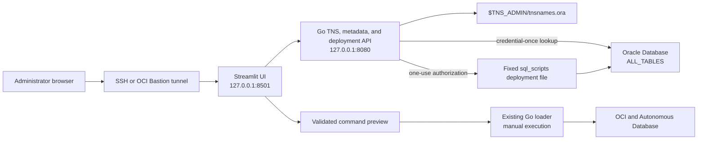

# Modular Streamlit frontend

This directory contains an optional browser frontend for the OCI FOCUS Loader.
It is deliberately separate from the Go loader so the interface can evolve
without embedding HTML, JavaScript, charts, and form logic in the Go binary.

The implementation uses Streamlit `1.60` or newer and Python `3.11`. Streamlit
currently supports Python 3.10 through 3.14; Oracle Linux 8.8 and later provide
Python 3.11 as an AppStream RPM. See the official
[Streamlit installation guide](https://docs.streamlit.io/get-started/installation/command-line)
and [Oracle Linux 8 Python guide](https://docs.oracle.com/en/operating-systems/oracle-linux/8/python/python-InstallingPython.html).

## What is implemented

- Independent Python/Streamlit process on `127.0.0.1:8501`.
- Go backend health validation through `GET /api/v1/health`.
- Ordered alias discovery through `GET /api/v1/tns/aliases`.
- First-tab database connection using the first TNS alias, an editable Oracle
  user (default `ADMIN`), a masked password field, and an optional schema owner.
- Read-only schema-table discovery through `POST /api/v1/database/tables` and
  CSV download of the returned owner/table names.
- A second **Deploy schema** tab that appears only after the first tab verifies
  the database login. It runs the fixed
  `sql_scripts/deploy_focus_schema_with_sqlloader_audit.sh` file, shows its
  redacted console result, reconnects with the submitted target-schema password,
  and lists every table in the created schema.
- Read-only display of the first TNS alias and `tnsnames.ora` source path.
- Interactive selection from every alias in the file.
- Form-based loader command builder for database load, pre-load report,
  upload-only, and upload-and-load modes.
- Instance-principal and OCI config-file authentication choices.
- Validation for required values, dates, workers, upload destinations, and
  control characters.
- POSIX-safe command quoting and shell-script download.
- Diagnostics page with local API commands and non-secret backend metadata.
- Python unit tests, Go API/parser tests, a systemd service, an automated
  installer, and a deployed-service smoke-test script.

The command builder does **not** execute the generated command and still accepts
only a Vault secret OCID for the loader's `-ds` option. After a successful first-
tab connection, the Go backend retains the administrator credentials only in
memory behind a random, 15-minute, one-use deployment token. Streamlit stores
only that opaque token, never the password. Both password forms are masked and
cleared; passwords are never logged, written to a configuration file, or
returned by the API.

## Architecture



The Streamlit process never reads the wallet or `tnsnames.ora`. The Go process
owns Oracle Net access. Alias responses contain only aliases, source path, and
read time. For a table lookup, Streamlit sends the submitted credentials to the
loopback-only Go API; the Go process uses the first alias, executes a fixed
bind-variable query against `ALL_TABLES`, returns owner/table names, and closes
the connection. A successful lookup also creates one short-lived deployment
authorization. The deployment API loads only the server-configured script,
passes both passwords through an anonymous inherited file descriptor instead of
command arguments or environment values, redacts both passwords from output,
and uses the new schema's password for the final fixed table query. The API URL comes from server-side `FOCUS_API_URL` and
cannot be changed by a browser user.

## Directory contents

```text
streamlit-ui/
|-- .streamlit/config.toml       Loopback server and safe UI defaults
|-- app.py                       Streamlit application
|-- command_builder.py           Validated POSIX command construction
|-- focus_api.py                 Dependency-free Go API client
|-- requirements.txt             Runtime dependency range
|-- requirements-dev.txt         Test dependencies
`-- tests/
    |-- test_app_smoke.py
    |-- test_command_builder.py
    `-- test_focus_api.py
```

Related deployment files are located in the parent repository:

```text
deploy/focus-loader-tns-gui.service.example
deploy/focus-loader-streamlit.env.example
deploy/focus-loader-streamlit.service.example
scripts/install-streamlit-ui.sh
scripts/test-streamlit-ui.sh
```

## API contract

### Health

```http
GET /api/v1/health
```

Example:

```json
{
  "status": "ok",
  "version": "26.7.0-schema-deployment-ui"
}
```

### TNS alias catalog

```http
GET /api/v1/tns/aliases
```

Example:

```json
{
  "aliases": ["focusdb_high", "focusdb_low"],
  "firstAlias": "focusdb_high",
  "sourcePath": "/opt/oracle/wallet/tnsnames.ora",
  "readAtUtc": "2026-08-10T12:00:00Z"
}
```

The original `GET /api/tns-alias` endpoint remains available for compatibility
with the embedded page.

### Database schema tables

```http
POST /api/v1/database/tables
Content-Type: application/json
```

Request body:

```json
{
  "username": "ADMIN",
  "password": "submitted-only-at-runtime",
  "schema": "FOCUS_APP"
}
```

The API always uses `firstAlias`; the browser cannot supply a different connect
descriptor. It does not execute caller-supplied SQL and needs no pre-existing
SQL file. The built-in query is equivalent to:

```sql
SELECT OWNER, TABLE_NAME
FROM ALL_TABLES
WHERE OWNER = :schema_owner
ORDER BY TABLE_NAME;
```

Example response:

```json
{
  "connectAlias": "focusdb_high",
  "username": "ADMIN",
  "schema": "FOCUS_APP",
  "deploymentToken": "opaque-one-use-value",
  "deploymentTokenExpiresAtUtc": "2026-08-10T12:15:00Z",
  "tableCount": 2,
  "tables": [
    {"owner": "FOCUS_APP", "tableName": "LOAD_STATUS"},
    {"owner": "FOCUS_APP", "tableName": "OCI_FOCUS"}
  ]
}
```

Treat the token as transient authentication data. It is accepted once by the
deployment endpoint and is then removed from backend memory, whether the script
succeeds or fails.

### FOCUS schema deployment

```http
POST /api/v1/schema/deploy
Content-Type: application/json
```

Request body:

```json
{
  "deploymentToken": "opaque-one-use-value",
  "targetSchema": "FOCUS_APP",
  "targetSchemaPassword": "submitted-only-at-runtime",
  "dropExisting": false,
  "dropConfirmation": ""
}
```

The backend supplies `TNS_ADMIN`, the first TNS alias, the authenticated
administrator user/password, fixed working and parent `focus.conf` paths, and
the fixed script path. The browser cannot select another shell script, TNS
directory, alias, or configuration path. `dropExisting=true` requires the UI
confirmation text `DROP <SCHEMA>`, which is also validated by the backend.
Common administrative schemas and the authenticated login schema are rejected
as deployment targets.

The response includes the script exit code, start/finish timestamps, redacted
combined output, deployment/table-lookup status, and the tables found by logging
in as the created schema with the submitted target password. A script failure is
returned as a structured result so its console output remains visible.

## Oracle Linux 8 prerequisites

The instructions assume:

- Oracle Linux 8.8 or newer;
- the `focusloader` service account already exists;
- the new Go binary is installed at
  `/opt/focus-loader/focus-loader-report-upload`;
- the service account can traverse the TNS directory, read
  `$TNS_ADMIN/tnsnames.ora`, and read the Oracle Net/wallet files required for
  a real connection (commonly `sqlnet.ora` and `cwallet.sso` for an ADB wallet);
- outbound access to the approved Python package repository is available
  during installation;
- Oracle SQL*Plus is installed and executable by `focusloader`;
- `/opt/focus-loader/focus.conf` exists and is writable by `focusloader` so a
  successful schema deployment can synchronize the loader configuration;
- `curl`, `systemd`, and OpenSSH are installed.

Install Python 3.11 without replacing Oracle Linux platform Python:

```bash
sudo dnf install -y python3.11 python3.11-pip
python3.11 --version
```

Do not remove Python 3.6 or change operating-system scripts to use Python 3.11.
The Streamlit service explicitly uses its own Python 3.11 virtual environment.

## 1. Build and install the updated Go backend

The gated schema deployment tab needs the API endpoint introduced in
`26.7.0-schema-deployment-ui`.

```bash
cd /opt/focus-loader/src
go mod download
go mod verify
CGO_ENABLED=1 go test ./...
CGO_ENABLED=1 go build -buildvcs=false -trimpath \
  -o dist/focus-loader-report-upload .

sudo systemctl stop focus-loader-tns-gui.service 2>/dev/null || true
sudo install -o focusloader -g focusloader -m 0750 \
  dist/focus-loader-report-upload \
  /opt/focus-loader/focus-loader-report-upload
/opt/focus-loader/focus-loader-report-upload -version
```

Expected version:

```text
focus-loader-report-upload 26.7.0-schema-deployment-ui
```

## 2. Verify TNS permissions

Set the actual wallet or Oracle Network configuration directory:

```bash
export TNS_ADMIN=/opt/oracle/wallet
sudo -u focusloader env TNS_ADMIN="$TNS_ADMIN" \
  test -r "$TNS_ADMIN/tnsnames.ora"
```

If this fails, inspect every directory component:

```bash
sudo -u focusloader namei -l "$TNS_ADMIN/tnsnames.ora"
```

Grant only the required group traversal/read permissions. Do not make a wallet
world-readable.

For the common case where `TNS_ADMIN=/home/oracle/adb_wallet` remains owned by
`oracle`, install the ACL tools and grant access to the alias plus the minimum
Oracle Net files needed by the schema browser:

```bash
sudo dnf install -y acl

sudo chmod 0700 /home/oracle/adb_wallet
sudo chmod 0600 /home/oracle/adb_wallet/tnsnames.ora
sudo chmod 0600 /home/oracle/adb_wallet/sqlnet.ora
sudo chmod 0600 /home/oracle/adb_wallet/cwallet.sso

# Allow focusloader to traverse the two directories.
sudo setfacl -m u:focusloader:--x /home/oracle
sudo setfacl -m u:focusloader:--x /home/oracle/adb_wallet

# Allow reading the alias and the common ADB mTLS runtime files.
sudo setfacl -m u:focusloader:r-- \
  /home/oracle/adb_wallet/tnsnames.ora \
  /home/oracle/adb_wallet/sqlnet.ora \
  /home/oracle/adb_wallet/cwallet.sso
```

Verify the resulting access:

```bash
sudo -u focusloader test -r /home/oracle/adb_wallet/tnsnames.ora
sudo -u focusloader test -r /home/oracle/adb_wallet/sqlnet.ora
sudo -u focusloader test -r /home/oracle/adb_wallet/cwallet.sso
sudo -u focusloader head -n 1 /home/oracle/adb_wallet/tnsnames.ora
sudo getfacl -p /home/oracle /home/oracle/adb_wallet \
  /home/oracle/adb_wallet/tnsnames.ora
```

It is intentional that `focusloader` can traverse the wallet directory but
cannot list it, so `ls /home/oracle/adb_wallet` may still fail for that user.
Wallet contents vary; if Oracle Net reports another required file, review that
file and grant read access explicitly rather than making the directory
world-readable.

## 3A. Automated installation

Review the installer before running it. It copies the UI and fixed deployment
script, creates an isolated virtual environment, installs Streamlit, installs
both systemd units, verifies SQL*Plus and configuration write access, and waits
for the local health endpoints.

```bash
cd /opt/focus-loader/src
less scripts/install-streamlit-ui.sh
sudo TNS_ADMIN=/opt/oracle/wallet \
  PYTHON_BIN=python3.11 \
  SQLPLUS_BIN=/usr/lib/oracle/23/client64/bin/sqlplus \
  ./scripts/install-streamlit-ui.sh
```

Optional installer environment variables:

| Variable | Default | Purpose |
| --- | --- | --- |
| `APP_DIR` | `/opt/focus-loader` | Installed loader and UI location. |
| `SERVICE_USER` | `focusloader` | Non-root systemd account. |
| `SERVICE_GROUP` | `focusloader` | Installed file group. |
| `PYTHON_BIN` | `python3.11` | Python used to create the virtual environment. |
| `TNS_ADMIN` | `/opt/oracle/wallet` | Directory containing `tnsnames.ora`. |
| `FOCUS_API_URL` | `http://127.0.0.1:8080` | Server-side Go API URL. |
| `SQLPLUS_BIN` | First `sqlplus` in root's `PATH` | Absolute SQL*Plus executable used to build the service `PATH`. |

The installer does not build or replace the Go executable. Complete step 1
first.

## 3B. Manual installation

Use this alternative when package downloads and service changes must be
performed separately.

```bash
sudo install -d -o focusloader -g focusloader -m 0750 \
  /opt/focus-loader/streamlit-ui
sudo install -d -o focusloader -g focusloader -m 0750 \
  /opt/focus-loader/streamlit-ui/.streamlit
sudo install -d -o root -g focusloader -m 0750 \
  /opt/focus-loader/sql_scripts

sudo install -o focusloader -g focusloader -m 0640 \
  streamlit-ui/app.py \
  streamlit-ui/focus_api.py \
  streamlit-ui/command_builder.py \
  streamlit-ui/requirements.txt \
  /opt/focus-loader/streamlit-ui/
sudo install -o focusloader -g focusloader -m 0640 \
  streamlit-ui/.streamlit/config.toml \
  /opt/focus-loader/streamlit-ui/.streamlit/config.toml
sudo install -o root -g focusloader -m 0750 \
  sql_scripts/deploy_focus_schema_with_sqlloader_audit.sh \
  /opt/focus-loader/sql_scripts/deploy_focus_schema_with_sqlloader_audit.sh
sudo install -o focusloader -g focusloader -m 0640 \
  sql_scripts/focus.conf /opt/focus-loader/sql_scripts/focus.conf
sudo -u focusloader test -w /opt/focus-loader/focus.conf
```

Create the virtual environment and install only the declared runtime packages:

```bash
sudo python3.11 -m venv /opt/focus-loader/streamlit-ui/.venv
sudo /opt/focus-loader/streamlit-ui/.venv/bin/python -m pip install --no-cache-dir --upgrade pip
sudo /opt/focus-loader/streamlit-ui/.venv/bin/python -m pip install --no-cache-dir \
  -r /opt/focus-loader/streamlit-ui/requirements.txt
sudo chown -R focusloader:focusloader /opt/focus-loader/streamlit-ui/.venv

/opt/focus-loader/streamlit-ui/.venv/bin/streamlit version
```

Create the service configuration:

```bash
sudo install -d -o root -g focusloader -m 0750 /etc/focus-loader
sudo install -o root -g focusloader -m 0640 \
  deploy/focus-loader-tns-gui.env.example \
  /etc/focus-loader/tns-gui.env
sudo install -o root -g focusloader -m 0640 \
  deploy/focus-loader-streamlit.env.example \
  /etc/focus-loader/streamlit.env

sudo vi /etc/focus-loader/tns-gui.env
sudo vi /etc/focus-loader/streamlit.env
```

Install and start the units:

```bash
sudo install -o root -g root -m 0644 \
  deploy/focus-loader-tns-gui.service.example \
  /etc/systemd/system/focus-loader-tns-gui.service
sudo install -o root -g root -m 0644 \
  deploy/focus-loader-streamlit.service.example \
  /etc/systemd/system/focus-loader-streamlit.service

sudo systemctl daemon-reload
sudo systemctl enable --now focus-loader-tns-gui.service
sudo systemctl enable --now focus-loader-streamlit.service
```

## 4. Validate on the Oracle Linux server

```bash
sudo systemctl status --no-pager focus-loader-tns-gui.service
sudo systemctl status --no-pager focus-loader-streamlit.service

curl -fsS http://127.0.0.1:8080/api/v1/health
curl -fsS http://127.0.0.1:8080/api/v1/tns/aliases
curl -fsS http://127.0.0.1:8501/_stcore/health
```

Run the complete smoke test:

```bash
chmod +x scripts/test-streamlit-ui.sh
./scripts/test-streamlit-ui.sh
```

Expected final line:

```text
All Streamlit frontend checks passed.
```

## 5. Open the UI from a workstation

Both services bind only to loopback. Create an SSH tunnel:

```bash
ssh -N -L 8501:127.0.0.1:8501 opc@SERVER_IP
```

Open:

```text
http://127.0.0.1:8501/
```

When OCI Bastion is required, add the same local-forward option to the SSH
command supplied for the active managed-SSH session. Do not open ports 8080 or
8501 in an NSG merely to reach this administrative interface.

For a shared production interface, use an authenticated reverse proxy and TLS.
Streamlit recommends terminating production TLS at a reverse proxy or load
balancer; see its [HTTPS guidance](https://docs.streamlit.io/develop/concepts/configuration/https-support).

## 6. Using the interface

### Database tables tab (first tab)

1. Confirm the displayed first TNS alias.
2. Enter `ADMIN` or another unquoted Oracle database user.
3. Keep **List the login user's schema** selected, or clear it and enter an
   accessible schema owner such as `FOCUS_APP`.
4. Enter the password in the masked field.
5. Select **Connect and list tables**.
6. Review or download the owner/table list. The password field clears and the
   backend connection closes after this request.

This tab does not accept SQL text and does not need a `.sql` file.

### Deploy schema tab (second tab after successful login)

1. Successfully connect in **Database tables**. The second tab then appears.
2. Confirm the loaded administrator user, first alias, and fixed script name.
3. Enter the target schema and its password twice.
4. Leave **Drop the existing target schema** disabled to preserve an existing
   user. The deployment DDL is not idempotent, so an existing set of tables can
   still cause the script to fail.
5. To replace a schema, enable the destructive option and enter
   `DROP <SCHEMA>` exactly. This runs `DROP USER ... CASCADE`.
6. Select **Run schema deployment** and wait for the console result.
7. Review the exit code, redacted output, and table list obtained by connecting
   as the target schema with the same target password.

The authorization is one-use. Authenticate in the first tab again before each
additional deployment. Closing/restarting the Go service also invalidates it.

### Connection tab

1. Confirm that backend status is `OK`.
2. Confirm the Go backend version.
3. Review the first TNS alias.
4. Select the database service alias to use in the command builder.
5. Expand **All aliases** when the expected service is not selected.

### Command builder tab

1. Choose the processing mode.
2. Choose instance-principal or OCI config-file authentication.
3. Enter the database username and selected TNS alias.
4. Enter the Vault secret OCID, never the password value.
5. Set source, destination, date, worker, and optional replay values.
6. Select **Validate and build command**.
7. Review the safely quoted command.
8. Download the shell script if required.
9. Review the downloaded file and execute it manually under the approved
   service account and change window.

The generated file includes `set -euo pipefail`. It is not run by Streamlit.

### Diagnostics tab

Use this page to copy local health commands and review non-secret API metadata.
It never displays the TNS descriptor, wallet contents, database password, OCI
API key, or Vault secret value.

## 7. Development and tests

Create a local virtual environment:

```bash
cd streamlit-ui
python3.11 -m venv .venv
source .venv/bin/activate
python -m pip install -r requirements-dev.txt
python -m unittest discover -s tests -v
streamlit run app.py
```

The UI expects the Go backend at `http://127.0.0.1:8080`. Override it only in
the server process environment:

```bash
FOCUS_API_URL=http://127.0.0.1:18080 streamlit run app.py
```

Go API tests from the repository root:

```bash
CGO_ENABLED=1 go test ./...
```

## 8. Logs and troubleshooting

Follow both services:

```bash
sudo journalctl -u focus-loader-tns-gui.service -f
sudo journalctl -u focus-loader-streamlit.service -f
```

### Streamlit reports that the Go backend is unavailable

```bash
sudo systemctl is-active focus-loader-tns-gui.service
curl -v http://127.0.0.1:8080/api/v1/health
sudo grep '^FOCUS_API_URL=' /etc/focus-loader/streamlit.env
```

An older binary does not have `/api/v1/schema/deploy`; install the
`26.7.0-schema-deployment-ui` binary before using the second tab.

### The alias endpoint returns an error

```bash
sudo grep '^TNS_ADMIN=' /etc/focus-loader/tns-gui.env
sudo -u focusloader bash -c \
  'source /etc/focus-loader/tns-gui.env && test -r "$TNS_ADMIN/tnsnames.ora"'
```

Restart after changing the environment:

```bash
sudo systemctl restart focus-loader-tns-gui.service
sudo systemctl restart focus-loader-streamlit.service
```

### Database connection or table lookup fails

Confirm the first alias, Oracle client, network route, and wallet access as the
service user:

```bash
FIRST_ALIAS=$(curl -fsS http://127.0.0.1:8080/api/v1/tns/aliases | \
  python3.11 -c 'import json,sys; print(json.load(sys.stdin)["firstAlias"])')
sudo -u focusloader env TNS_ADMIN=/home/oracle/adb_wallet \
  tnsping "$FIRST_ALIAS"
sudo -u focusloader test -r /home/oracle/adb_wallet/sqlnet.ora
sudo -u focusloader test -r /home/oracle/adb_wallet/cwallet.sso
```

`ORA-01017` normally means the database user/password is incorrect.
`ORA-12154`, `ORA-12514`, or wallet/TLS errors normally indicate alias, Oracle
Net, wallet-file, or network configuration problems. The schema owner must be
visible to the login user through `ALL_TABLES`.

### Schema deployment fails or the second tab does not appear

The tab appears only after a successful first-tab login. Check the backend
version, fixed script, SQL*Plus, configuration permissions, and service settings:

```bash
/opt/focus-loader/focus-loader-report-upload -version
sudo -u focusloader test -x \
  /opt/focus-loader/sql_scripts/deploy_focus_schema_with_sqlloader_audit.sh
sudo -u focusloader test -w /opt/focus-loader/sql_scripts/focus.conf
sudo -u focusloader test -w /opt/focus-loader/focus.conf
sudo -u focusloader bash -c \
  'source /etc/focus-loader/tns-gui.env && command -v sqlplus && sqlplus -version'
sudo journalctl -u focus-loader-tns-gui.service -n 200 --no-pager
```

An HTTP `401` means the one-use token expired, was already consumed, or the Go
service restarted; authenticate again. HTTP `409` means another deployment is
running. A nonzero script exit code is displayed with its redacted output.

### Port already in use

```bash
sudo ss -ltnp | grep -E ':(8080|8501)[[:space:]]'
```

Stop the conflicting process or deliberately update both the service and
environment settings. Do not expose the listener publicly as a shortcut.

### Python installation fails

Confirm the Oracle Linux release and repositories:

```bash
cat /etc/oracle-release
sudo dnf repolist
sudo dnf info python3.11 python3.11-pip
```

Oracle Linux 8.8 or newer is required for the documented Python 3.11 RPM path.

## 9. Upgrade and rollback

Back up configuration and capture installed versions:

```bash
sudo cp -a /etc/focus-loader /etc/focus-loader.backup.$(date +%Y%m%d%H%M%S)
/opt/focus-loader/focus-loader-report-upload -version
/opt/focus-loader/streamlit-ui/.venv/bin/streamlit version
```

For an upgrade, install the new Go binary, recopy the Streamlit files, update
the virtual environment from `requirements.txt`, then restart both services.

To disable only the new interface while retaining the loader:

```bash
sudo systemctl disable --now focus-loader-streamlit.service
```

The embedded read-only Go page remains available through port 8080 while the
Go backend service is running. Restore a previously backed-up binary and UI
directory to roll back application code.

## Security boundary

- Both listeners default to `127.0.0.1`.
- The browser cannot override the backend URL.
- Streamlit does not read the wallet or TNS file.
- The API does not return connect descriptors or wallet contents.
- Both credential forms mask and clear their passwords after submission.
- The administrator password is retained only in Go process memory for at most
  15 minutes behind a random one-use token. Streamlit stores only the token.
- The target password exists only for the deployment request and created-schema
  verification. Passwords reach the script through an anonymous inherited file
  descriptor, are not placed in its command arguments/environment, and are
  redacted from returned errors/output.
- The metadata query is fixed in the Go binary and binds the schema value; no
  browser-supplied SQL is accepted.
- The only executable deployment target is the server-configured
  `deploy_focus_schema_with_sqlloader_audit.sh`; browser users cannot supply a
  command, script path, TNS path, alias, or config path.
- The installer makes the script and its directory root-owned. The hardened Go
  service receives write access only to the installed working and parent
  `focus.conf` files.
- `dropExisting` defaults to false and destructive replacement requires explicit
  UI confirmation. Use database auditing/change controls for production runs.
- The command builder remains separate and never requests a database password.
- The UI generates but never executes loader commands.
- Shell arguments are represented as an argument list and POSIX-quoted.
- The services run as the unprivileged `focusloader` account with systemd
  hardening directives.
- Use an authenticated TLS reverse proxy before any shared network exposure.
- Review dependency updates and GitHub security alerts before deployment.

This is independent software and is not affiliated with, endorsed, certified,
or supported by Oracle Corporation.
